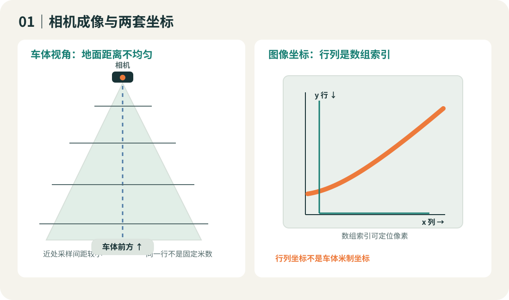
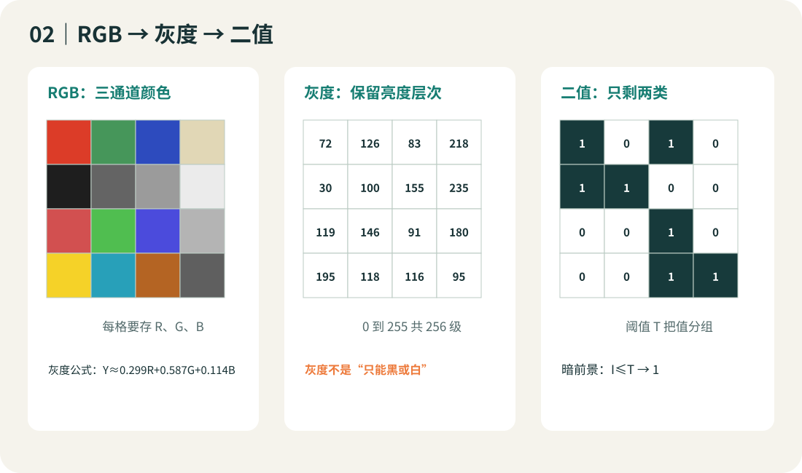
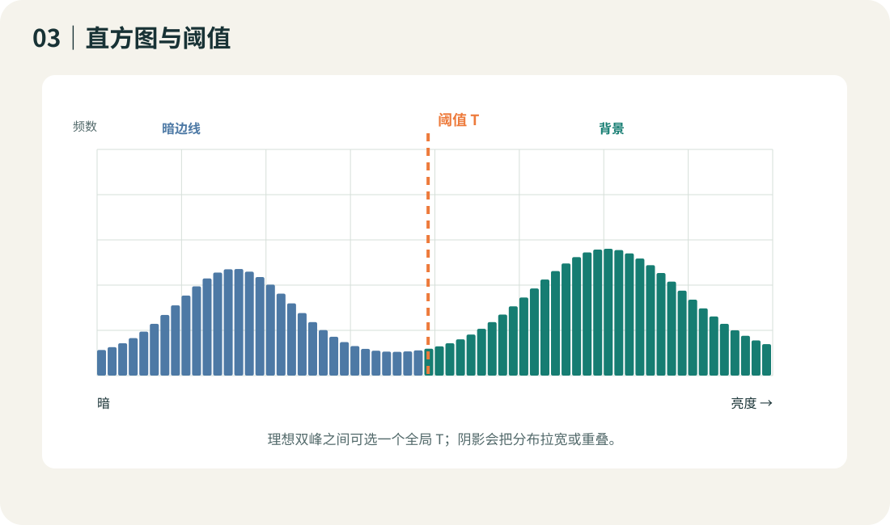
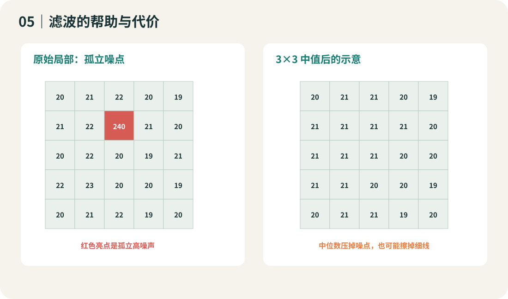
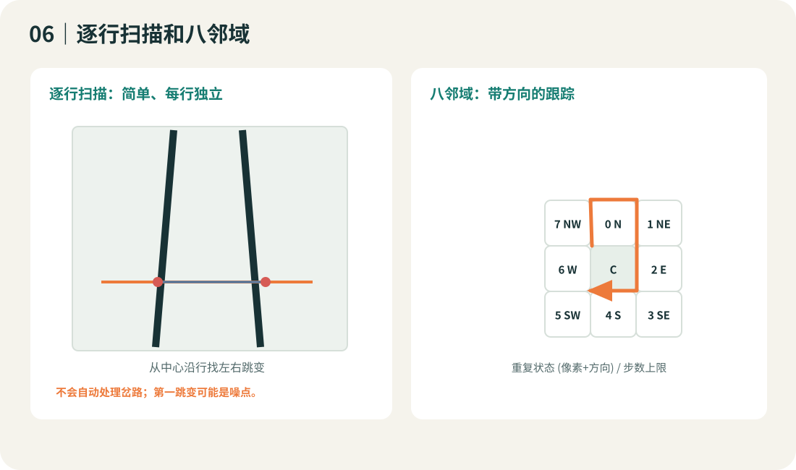
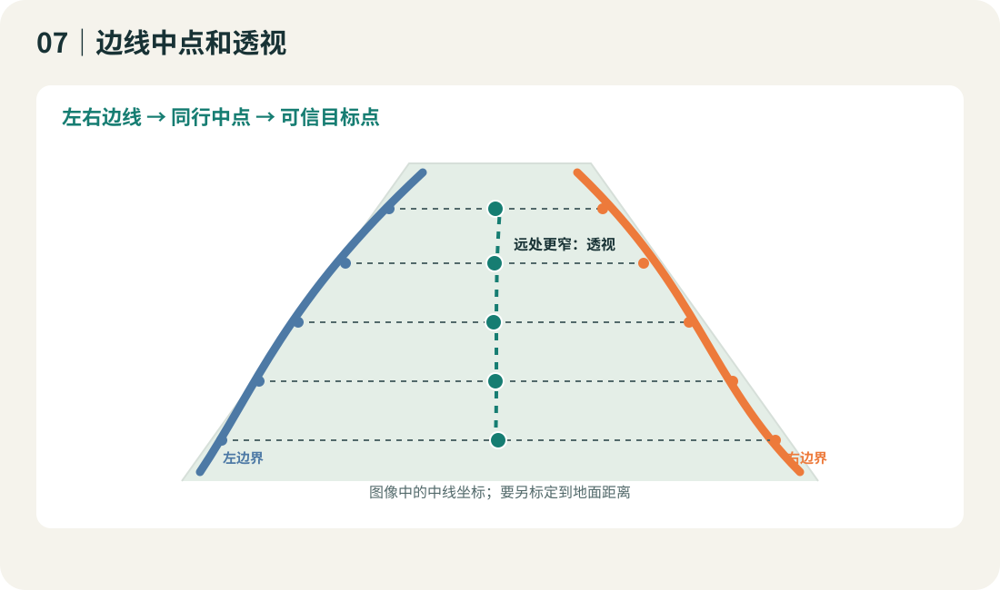
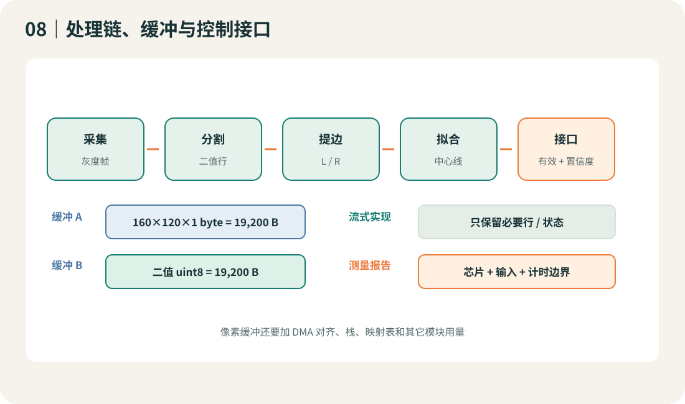
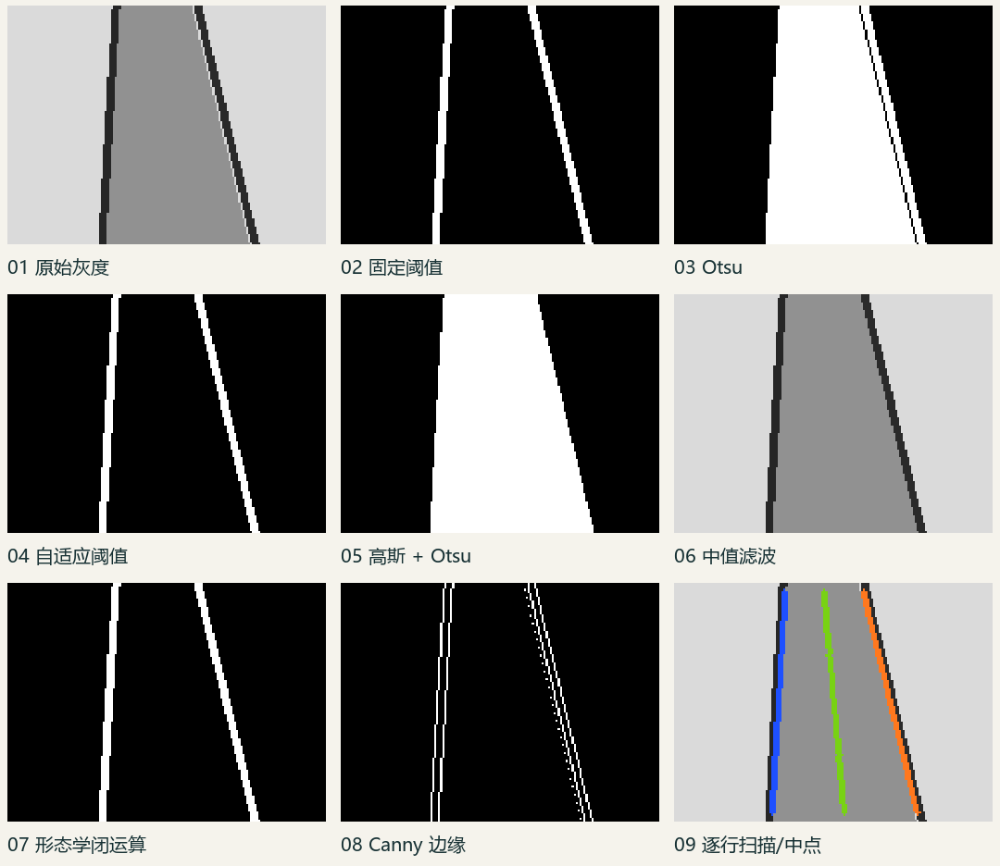

# 镜头车图像处理：从像素到可用赛道特征

新生培训讲义 · 版本 1.0 · 资料核验日期 2026-09-27

> 这份讲义讲的是通用单目摄像头循迹处理链，不是任何届次的官方规则说明。课程不假定实验室的目标组别、相机或主控已知。赛道元素、传感器数量、相机限高、硬件和比赛任务都必须按目标届次与组别的最终规则确认。文中所有练习帧由代码生成，未使用未授权实验室图像。

## 学完后应该会什么

- 解释像素、行列坐标、灰度值、二值图和传感器像素格式之间的区别。
- 能手算灰度化、阈值分割和图像内存需求。
- 能为同一帧比较基础、进阶和横向方案，并指出它们何时会失效。
- 能从二值像素中读出左右边界和中线，再将带有效性与置信度的结果交给控制模块。
- 能用离线回放比较不同光照、噪点、急弯和缺边条件，不把个人设备实测参数写成普遍定律。

## 六次课路线图（320 分钟）

| 课次 | 内容 | 时长 | 课后产出 |
|---|---|---:|---|
| 1 | 成像、坐标、像素、灰度 | 50 分钟 | 3 个 RGB 灰度手算 |
| 2 | 固定阈值、Otsu、自适应阈值 | 55 分钟 | 5×5 二值化过程 |
| 3 | 减量、去噪、形态学 | 55 分钟 | RAM 预算表 |
| 4 | 扫描、八邻域、Canny/连通域 | 55 分钟 | 5×5 邻域跟踪 |
| 5 | 中线、透视、赛道元素 | 60 分钟 | 直道/弯道中线草图 |
| 6 | MCU 落地、回放、测量 | 45 分钟 | 有可复现输入的测量记录 |

知识依赖：坐标/像素格式 → 灰度/直方图 → 二值极性 → ROI/降采样/位打包 → 去噪 → 边界 → 中线/透视 → 元素稳定性 → 嵌入式预算。

## 0. 成像、像素和坐标

### 这一步解决什么

摄像头把光线采样成数组。单个像素不是一块真实赛道，而是传感器对小片区域的采样值。程序常用 `img[y, x]` 访问像素：`x` 是列，向右增加；`y` 是行，向下增加。车体坐标常规定义为前方为正、左方为正；它和图像坐标方向不同，不能把“图像上方”直接当作“车体前方距离的线性刻度”。

### 基础算法：读数组和 ROI

输入是相机帧 `H×W` 或 `H×W×C`；输出是某行、某列或一块裁剪区域。先打印 `shape`、数据类型和每通道字节数，再用 `img[y0:y1, x0:x1]` 取 ROI。Python/OpenCV 的矩阵索引是先行后列；赛道示意图上的水平坐标却通常写作 `x`。ROI 只留下所需部分，因此降低处理像素数；它也会永久丢弃画框外的信息。

### 进阶算法：曝光、动态范围与 ROI

灰度直方图把 0 到 255 的像素按亮度计数。直方图挤在 0 附近表示很多区域过暗，挤在 255 附近表示高亮饱和风险；曝光、增益、光圈（若硬件支持）是成像阶段控制量。已经被剪到全黑/全白的细节不会因后续阈值自动恢复。按下方近处、上方远处等几何用途选择 ROI 时，要在实车相机方向上用已知距离和画面位置实测标定，不把像素行当成等距米制坐标。

### 横向扩展：Bayer、YUV 与灰度传感器

RGB/BGR 是每像素多通道颜色；Bayer 原始阵列每个位置通常只采一个颜色分量，需去马赛克才能得到完整 RGB；YUV 常把亮度 Y 与色度分开，部分传感器可直接读取 Y 平面；灰度传感器直接给一个亮度样本。不同格式不能只看一个 `uint8*` 指针就假定布局相同。先查相机输出格式、行跨度、字节序和有效分辨率，再写转换程序。[S10]

**适用/失败：** 视野范围、安装角度、运动模糊、曝光、镜头畸变和阴影都会改变图像；严重过曝不是“换一个阈值”就能挽回的。摄像头高度限制在历史规则中随届次、组别不同，历史 CSDN 文章中的测量方式可作启发，具体数值不能照搬。[S14]

**资源：** 裁剪前扫描全图需要 `O(HW)` 次像素访问；裁剪后算法访问 `O(HrWr)` 个像素。对 8-bit 灰度帧，原始像素缓冲为 `H×W` 字节（不含对齐、DMA 或临时缓冲）。

**延伸资料：** [OpenCV 图像数组与灰度操作](https://docs.opencv.org/4.12.0/d5/d98/tutorial_mat_operations.html) · [CSDN 历史镜头经验](https://modelers.csdn.net/69a7a1ea7bbde9200b9d5b64.html)

## 1. 灰度化：把颜色简化成亮度

### 这一步解决什么

对主要按明暗区分赛道和地面的场景，一通道灰度值比三通道颜色少存数据，也让阈值和边缘计算更直接。灰度不是黑白：一个 8-bit 灰度像素仍有 256 种可能值。

### 基础算法：加权 RGB 亮度

常用近似式为 `Y = 0.299R + 0.587G + 0.114B`。例如纯红 `(255,0,0)` 得约 `76`，纯绿约 `150`，纯蓝约 `29`。小例子 `R=100,G=150,B=200` 得 `29.9+88.05+22.8=140.75`，取整约 `141`。公式更重视人眼对绿色的亮度敏感性；OpenCV 的输入通常按 BGR 排列，转换时使用 `COLOR_BGR2GRAY`，不要把通道顺序写反。[S10]

### 进阶算法：伽马与局部对比度

伽马校正可写作 `I' = 255 × (I/255)^γ`。`γ<1` 会提亮暗部，`γ>1` 会压暗中低亮度；它改变像素分布，不会恢复传感器未采到的细节。CLAHE 等局部直方图方法能增加局部对比，但可能放大噪点并增加计算量。先在实际采集帧上确认有稳定可用的边界，再决定是否需要增强。

### 横向扩展：保留 Y 通道或直接用灰度传感器

如果相机能直接输出灰度或 Y 平面，可跳过 RGB 转换以节省采集带宽和计算；代价是不能再用色相/饱和度区分同亮度异颜色的区域。对于彩色路面、标记色块或反光颜色特征，先在 RGB/HSV/YUV 上比较目标可分性，灰度化会主动抛弃颜色信息。

**适用/失败：** 灰度适合亮度对比明显的赛道边线；颜色差异明显但亮度相同的材料会在灰度图里混淆。运动模糊或过曝造成的边界丢失，伽马和直方图均衡可能无法修复。

**资源：** RGB888 为 `3HW` 字节；灰度 8-bit 为 `HW` 字节。转换时间是 `O(HW)`；原地复用缓冲需确认源数据与目标数据不会覆盖未读通道。

**延伸资料：** [OpenCV Operations with images](https://docs.opencv.org/4.12.0/d5/d98/tutorial_mat_operations.html)

## 2. 黑白二值化：让后续算法只看两类像素

### 这一步解决什么

把连续亮度映射到两类。以下统一约定：**暗边线/前景记为 1（显示白色），背景记为 0（显示黑色）**，这样可以直接用连通域或轮廓接口。若画面使用“黑线白地”，阈值方向需要反过来。二值像素只有类别，不再保存原亮度。

### 基础算法：固定全局阈值

暗前景的表达式是 `B(x,y)=1` 当且仅当 `I(x,y) ≤ T`。手算 5×5 矩阵时只需逐格比较 `I` 与阈值 `T`。例如 `T=100`，值 32→1、98→1、102→0、220→0。输入灰度帧和一个阈值，输出二值帧。阈值容易理解、实现快、内存可小；光照整体变化时，同一个 `T` 可能把边线并入背景或把阴影变成前景。

### 进阶算法：Otsu 与局部自适应

Otsu 从整帧直方图选择阈值，使两类的加权类内方差最小；用累计计数和累计亮度可在 256 级直方图上单遍评估候选阈值。它适合直方图有明显双峰、两类亮度稳定分开的场景；整帧阴影与高光混在一起时，单个全局阈值仍会失败。[S09]

局部阈值在每个小窗口算局部均值或高斯加权均值。暗前景的一种规则为 `I(x,y) < mean_N(x,y) - C`。窗口太小会跟着噪声跳，太大又退化成全局阈值；积分图可把窗口求和从每像素重复遍历改成常数次查表，但需要额外累计缓冲。赛道场景也可按行采样边界候选，并随行更新阈值，但起点和采样必须可靠，不能用错误种子自我强化。

### 横向扩展：迭代双均值、时序阈值、按需判点

迭代双均值从初值 `T0` 开始，将小于/大于阈值的像素分两组，算 `m_dark` 和 `m_bright`，再更新 `T=(m_dark+m_bright)/2`，直到变化很小。它与 Otsu 的目标函数不同，不保证得到同一阈值；若某一类为空或直方图不是双峰会不稳定。时序阈值可用上帧阈值作缓慢更新并限幅，但要检测曝光突变，避免反应太慢。若最终只需边线附近少量采样，也可比较相邻像素差或局部对比，不必先存一整幅二值图。

**适用/失败：** 阴影、反光、赛道污渍、背景纹理、边线宽度变化和前景极性都影响分割。固定阈值滑杆演示的是算法敏感性，不提供某个摄像头的推荐阈值。

**资源：** 固定阈值、Otsu 直方图和逐像素局部阈值的访问量大致 `O(HW)`；朴素窗口局部求均值为 `O(HWk²)`，积分图可把主计算降为 `O(HW)`。全图阈值化若输入/输出分别保存，要另有 `HW` 字节（以 uint8 保存）或 `ceil(HW/8)` 字节（位打包）。

**延伸资料：** [OpenCV Image Thresholding](https://docs.opencv.org/4.12.0/d7/d4d/tutorial_py_thresholding.html) · [第 17 届队伍技术报告中的二值化个案](https://blog.csdn.net/zhuoqingjoking97298/article/details/126573548)

## 3. 图像减量：三种“压缩”不是同一件事

### 这一步解决什么

嵌入式视觉常受传输时间、RAM 和计算预算限制。先问清楚瓶颈是哪一种，再决定减少空间像素、每像素位数，还是文件编码字节数。

### 基础算法：ROI 裁剪与规则降采样

ROI 把范围缩小到需要判断的区域；隔点取样把每 2×2 区域取一点，宽高各减半，像素数变成四分之一。前者和后者都改变了像素数量，属于**空间减量**，不可逆，会丢掉视野或细节。最近邻适合示意和二值图；连续灰度缩小常用区域平均/面积插值以减轻混叠。OpenCV 官方缩放文档介绍了 resize 和插值接口。[S12]

### 进阶算法：位打包、行缓存和流式处理

二值图若每个像素仍放一个字节，只把值从 0/255 改成 0/1，文件大小仍是一个像素一个字节。把 8 个二值像素塞入一个 byte 才是**像素位宽减量**，空间约降 8 倍；读取第 `x` 个 bit 需要 `(buf[x>>3] >> (x&7)) & 1`。行缓存只保留滤波所需的前后几行；流式处理只保留阶段间必要状态。它们节约 RAM，但不一定减少相同像素数上的运算。

### 横向扩展：PNG/JPEG 文件编码

PNG 对图像数据做无损文件编码，解码可恢复原像素；JPEG 通常有损，参数越激进越容易引入块状/振铃边缘伪影。它们改变的是**文件/传输表示**，不是算法运行时必然占用的原始帧缓冲。MCU 收到编码图像仍需解码器、工作区和时间预算；相机若直接输出 JPEG/PNG，具体取决于硬件与固件。不能把“JPEG 文件很小”直接等同“车上 RAM 同样小”。

**手算：** `W=160,H=120` 时灰度 8-bit 是 `160×120=19,200 B`；RGB888 是 `57,600 B`；二值 uint8 仍是 `19,200 B`；紧凑位图是 `ceil(19,200/8)=2,400 B`。若灰度做 80×60 降采样，是 `4,800 B`；该尺寸再位打包二值为 `600 B`。双缓冲还需把相应像素缓冲乘 2，并另外加 DMA 对齐、行填充、栈、堆和其它模块占用。以上是算术，不是任何 MCU 的实测值。

**失效与取舍：** 降采样会抹掉远处窄边线，ROI 选错会裁掉弯道，JPEG 伪影可能改变阈值边界，位打包增加位操作。先保留一帧原始输入，再逐级减少分辨率并验证边线覆盖。

**延伸资料：** [USTB_Swan README 的资源取舍记录](https://github.com/BiliLBD/USTB_Swan/blob/main/README.md) · [OpenCV resize 与几何变换](https://docs.opencv.org/4.12.0/da/d6e/tutorial_py_geometric_transformations.html)

## 4. 去噪和结构修复

### 这一步解决什么

噪点会变成孤立前景或破坏边界连续性。滤波可以降低部分噪声，但可能同时模糊或抹掉真正的细边线。处理前后必须同时看结果和几何特征。

### 基础算法：均值和中值

3×3 均值用邻域 9 个亮度的平均值替换中心；中值将 9 个数排序，取第 5 个。均值简单但容易模糊边缘；中值对孤立椒盐噪点常更稳，却也可能删除比窗口窄的真实线段。OpenCV 提供 blur、GaussianBlur、medianBlur 等平滑接口。[S11]

### 进阶算法：高斯滤波、形态学开闭

高斯滤波让距离中心越近的邻点权重越大，可减轻高频噪声；模糊会把边缘扩散。对二值图，腐蚀收缩白色前景、膨胀扩张白色前景；开运算是先腐蚀再膨胀，可去小白点；闭运算是先膨胀再腐蚀，可填小黑孔或窄断口。核尺寸大于真实赛道细节时会把两条边连起来或把边线抹掉。

### 横向扩展：按噪声类型选择处理

椒盐噪点可先试中值；近似连续小幅随机噪声可试高斯；缓慢变化照明可先调整相机曝光或局部阈值，而不是无限加大平滑窗口；单点缺口可用小核闭运算，但长断线要用时序或几何补线。形态学是局部形状修复，不知道哪一条线才是真赛道，不能独自作语义判断。

**输入/输出与成本：** 输入灰度或二值帧，输出同尺寸帧。k×k 直接卷积通常每像素约 `k²` 个邻值，固定 k 时为 `O(HW)`；可分离高斯可减少乘加数；中值还要在邻域中找秩次。`uint8` 全图输出额外为 `HW` 字节；流式的 k 行实现可用约 `kW` 的行缓冲加少量状态。具体耗时在目标芯片上量测。

**延伸资料：** [OpenCV Smoothing Images](https://docs.opencv.org/4.13.0/dc/dd3/tutorial_gausian_median_blur_bilateral_filter.html)

## 5. 边线提取：从分类像素得到坐标

### 这一步解决什么

阈值图还不是路径。循迹算法往往只需要若干行上的边界坐标，而不是把每个像素都送给控制器。以下假设暗边线在二值图中为前景；如果检测的是白色路面或其他标记，极性和搜索方向需相应调整。

### 基础算法：按行向两侧扫描

在选定的行 `y` 从图像中心 `cx` 向左/右扫描，寻找满足阈值的第一个边线像素，记作 `L[y]`、`R[y]`。相邻行可用上一行坐标作搜索起点，但保留最大搜索半径。输入为二值或灰度行，输出每行左右边线与 valid 标志。最坏访问 `O(HW)`，若每行搜索半宽为 `r` 则约 `O(Hr)`。实现简单、容易调试；横向杂点可能是“第一条边”，交叉口也会出现多个候选。

### 进阶算法：八邻域边界跟踪和迷宫式跟踪

以已知前景种子为中心，依固定方向顺序检查 N、NE、E、SE、S、SW、W、NW 邻点；找到相邻前景后移动，并从上次方向的邻近方向继续搜索。没有候选时按上一步策略回溯；遇到岔路必须有固定选择规则。要限制步数并记录“像素 + 进入方向”状态：重复状态可说明闭环，孤立点或搜索完毕可说明终止；只有标记坐标不标记方向，可能会过早判定。越界必须拒绝，不可把图像首尾相连。USTB_Swan 的作者叙述曾从八邻域改成迷宫法以应对卡点，也提到内存和逆透视数据的取舍；这是该队伍自身经历，不意味着某法普遍更快。[S04]

### 横向扩展：Canny、连通域、轮廓

Canny 依据图像梯度、非极大抑制和双阈值连接输出边缘；它能找很多物体边缘，但不自动知道哪条是赛道边界，噪点也会产生候选。[S13] 连通域把邻接的前景像素分组，可按面积、宽高和位置筛选；轮廓描述二值前景的边界形状。OpenCV 轮廓教程建议先准备二值图且关注前景极性。[S13] 这些方案适用于有多个候选、需要整体连通和形状信息的场景，但会用更多中间数据。

**八邻域顺序图：** `0=N,1=NE,2=E,3=SE,4=S,5=SW,6=W,7=NW`，实现时也可反向编号；关键是全程一致。遇到岔口先按课程规则选边，并存下进入方向与访问状态。

**失败案例：** 种子落在背景，线条有缺口，十字路口有多条分支，阴影造成假前景，贴图边缘越界，闭环未正确终止。逐行扫描一般不表达边线走向；八邻域给出走向但更依赖连通性和回溯策略。

**延伸资料：** [USTB_Swan README](https://github.com/BiliLBD/USTB_Swan/blob/main/README.md) · [OpenCV 轮廓教程](https://docs.opencv.org/4.12.0/d4/d73/tutorial_py_contours_begin.html) · [CSDN 迷宫/八邻域个案](https://damodev.csdn.net/6880a5f0bb9d8e0ecec2b1f8.html)

## 6. 中线与路径表达

### 这一步解决什么

控制模块需要可跟踪的目标点、偏差或短路径。图像边界坐标要先转成受约束的道路表示，并报告哪些行可信。

### 基础算法：双边中点

若某一行两侧边线有效，`C[y]=(L[y]+R[y])/2`。例如 `L=38,R=122`，中点为 80。输出中线数组和 valid mask。它假设左右边界都在同一行正确识别，且赛道宽度变化不会使中点偏离期望轨迹。弯道、交叉、单边丢线或一侧抓到错误标记都会让中点出错。

### 进阶算法：单边估计、曲线拟合与前瞻点

仅一侧可靠时，可用该行的预期半宽 `w[y]` 估计 `C=L+w` 或 `C=R-w`。`w[y]` 需通过实际赛道几何标定，不可假定恒定。对有效点拟合 `x(y)=ay²+by+c`，平方误差最小化适合平滑弯曲但会受离群点影响；RANSAC 可容忍部分离群点，计算量更高且参数需测。前瞻点是从拟合曲线选取较远行的横向偏差，能提前反映弯道趋势；离图像上缘太近的点对小误差敏感，应结合置信度和有效范围。

### 横向扩展：鸟瞰/逆透视变换

透视会让远处同宽的赛道在图像里变窄。选取地面四个对应点后，用 3×3 单应矩阵 `p' ~ H p` 映射到鸟瞰平面。OpenCV 用 `getPerspectiveTransform` 求四点映射，再通过 `warpPerspective` 重采样；缩放与变换的插值规则会影响边界。[S12] 鸟瞰图让平行线和宽度更容易比较，但需要标定、重采样和额外缓冲；安装变化或弯道路面不平会使单应近似失效。存全映射表增加 Flash/RAM，逐像素求变换增加算量。

**接口建议：** 交给控制模块的是 `frame_id, center[y], valid[y], confidence, event_hint` 等结构化结果，而不是让控制模块重读私有全局图像缓冲。缺边时输出“无效/低置信度”比静默伪造坐标安全。转向/速度如何使用这些量属于后续控制课程。

**延伸资料：** [OpenCV Perspective Transformation](https://docs.opencv.org/4.12.0/da/d6e/tutorial_py_geometric_transformations.html) · [USTB_Swan 逆透视标定工具说明](https://github.com/BiliLBD/USTB_Swan/blob/main/README.md)

## 7. 赛道元素与时序稳定性

### 这一步解决什么

赛道几何会在岔路、十字、环岛或坡道中暂时违背“双边线平行、宽度固定”的假设。只凭单帧局部变化切换模式容易来回抖动。

### 基础算法：几何特征规则

按行记录边界宽度 `W[y]=R[y]-L[y]`、左右边线斜率变化、连续缺边行数和分支数量。输入为边线点，输出候选事件特征。环岛/十字/三岔可在几何上出现边线消失、分支增加或边界突变；这些只是候选规则，不代表赛事一定有该元素。只纳入当届目标组别确实出现的元素。[S03]

### 进阶算法：多帧状态机、置信度与回退

示例状态：FOLLOW → APPROACH → ENTER → PASS → EXIT → FOLLOW。用多帧的几何证据确认进入，用滞回阈值避免一帧就切换，并设置基于实际帧率校准的最长持续条件。置信度可组合有效边线覆盖率、宽度连续性、曲线拟合残差和前后帧差异：`q = a·coverage - b·fit_error - c·width_jump`。`a,b,c` 是待标定权重，不是本文声称的最优数值。低置信度时回退到上一可信路径或受限搜索，并报告缺边；不能持续沿用陈旧路径且不设上限。

### 横向扩展：时间滤波和传感器/分类器融合

短窗口中位数可过滤单帧跳点；指数平滑 `z_t=λx_t+(1-λ)z_(t-1)` 平缓输出，但 `λ` 太小会产生跟踪延迟。若组别和车载配置允许，可把陀螺仪、编码器、颜色或目标识别作为辅助证据；具体传感器限制必须查当届规则。上交 AuTop 的 RT1064 主控、OpenART 识别代码和 LiveViewer 分别处于不同链路层，不能把 OpenART 的识别任务等同于黑线寻迹，也不能把显示窗口伪影当作原始像素错误。[S05][S06][S07]

**失效边界：** 图像断线、出画、强阴影、反光饱和、坡道改变透视、场景中有重复标记，或状态机没有超时/复位时都会出错。几何阈值应通过覆盖的正反例集验证，不报告未经复现的正确率。

**延伸资料：** [第 21 届规则页面（CSDN，组别线索）](https://aiot.csdn.net/6a82ced410ee7a33f29c1841.html) · [SJTU AuTop Openart-Code](https://github.com/SJTU-AuTop/Openart-Code/blob/main/README.md) · [B 站状态机视频（仅选学）](https://www.bilibili.com/video/BV1jr421V7t1/)

## 8. 上板与调试：先保证结果可复现

### 这一步解决什么

PC 上“看起来正确”不代表 MCU 上时间和内存够用。固定输入可以把摄像头、处理算法、显示传输和控制误差分开定位。

### 基础算法：离线回放与中间图

存一组同尺寸灰度输入及场景标签，逐帧运行：原图 → 灰度 → 二值 → 去噪 → 边线 → 中线。每一步写出图和参数；出现错误时找第一个与预期不同的中间结果。对每次改动重放完全相同的数据并保存代码版本、参数和输出。不要只看车是否跑到终点。

### 进阶算法：执行预算、行复用和定点化

在目标板上围住单帧处理函数测量时间，记录最慢输入和测量边界；报告时区分传感器采集、DMA、预处理、显示串口和控制周期。统计数组尺寸、双缓冲、映射表、栈和堆；逐项减少缓冲后确认数据生命周期。固定点数值可降低没有 FPU 的目标上的代价，但要量化位宽、舍入和溢出对边界位置的影响。不得拿 PC 的耗时冒充 MCU 耗时。

### 横向扩展：质量-延迟-RAM 三维比较

固定一组正常直道、急弯、单边缺失、阴影、反光、椒盐噪声和低分辨率合成帧，再追加授权实车帧。比较算法的有效行覆盖、左右边线偏差、帧处理时间和峰值缓冲。只在相同输入、同一处理计时边界、同一编译优化选项下比较。任何报告数值都附芯片型号、时钟、编译器、分辨率、代码版本、场景、测量方法和样本数。

**可复现 MCU 伪代码：**

~~~c
for each frame:
    capture_gray(frame_buffer, width, height);
    threshold_rows(frame_buffer, binary_rows, width, height);
    scan_boundaries(binary_rows, left, right, valid, width, height);
    estimate_center(left, right, valid, center, confidence, height);
    publish_features(frame_id, center, valid, confidence);
~~~

此处的 `capture_gray`、阈值和接口是待按硬件实现的函数名，不是可直接编译的驱动。不要在实时循环中逐帧 `malloc`；考虑静态/预分配缓冲、尺寸上限与错误返回。

**延伸资料：** [USTB_Swan 图像与离线调试工具](https://github.com/BiliLBD/USTB_Swan/blob/main/README.md) · [SJTU AuTop RT1064-Code](https://github.com/SJTU-AuTop/RT1064-Code/blob/master/README.md) · [LiveViewer 上位机](https://github.com/SJTU-AuTop/LiveViewer/blob/main/README.md)

## 三类减量一页对照

| 操作 | 改变什么 | 典型可逆性 | 运行时 RAM 是否必然按文件比例下降 |
|---|---|---|---|
| ROI/裁剪、降采样 | 空间像素数和画面内容 | 丢弃部分信息，通常不可逆 | 若处理和缓存都使用较小尺寸，像素缓冲会下降 |
| 量化、二值化、位打包 | 每像素表达位数 | 二值化丢亮度；位打包本身可还原这些二值位 | 位打包可降低二值存储，需增加解包/位运算 |
| PNG/JPEG 编码 | 文件或传输的字节表示 | PNG 无损；JPEG 通常有损 | 解码后的帧仍可能需要原尺寸工作缓冲 |

## 可运行示例

运行后会生成 160×120 合成赛道图、固定/Otsu/自适应阈值、滤波、边缘和逐行扫描结果，以及多种失败场景的中间图。所有数值记录都来自这组人造帧，不代表比赛场地。

~~~powershell
cd examples
python -m venv .venv
.\.venv\Scripts\Activate.ps1
python -m pip install -r requirements.txt
python demo.py --out generated
~~~

预期输出目录包括 `normal_gray.png`、`normal_binary_fixed.png`、`normal_edges_canny.png`、`normal_rows.png` 和 `metrics.csv`。脚本打印输入尺寸、格式、内存公式、行扫描覆盖量与本机实测处理时间；本机输出不得外推为 MCU 实测。详见 [examples/README.md](examples/README.md)。

## 分章练习与答案

### 0. 坐标和成像

1. 访问 `img[12,30]`，它是哪一列、哪一行？  
2. 画面上方是否必然对应车前方固定多少厘米？  
3. 若 160×120 灰度裁成 80×60，像素数变为多少？

答案：1. 第 30 列、第 12 行；2. 否，受透视和安装影响；3. 从 19,200 降到 4,800，四分之一。

### 1. 灰度化

1. 用加权式估算 RGB=(0,255,0) 灰度。  
2. 灰度是否只有 0 和 255 两个值？  
3. BGR 输入误当 RGB 处理会怎样？

答案：1. 约 150；2. 否，8-bit 灰度有 256 个码值；3. 红/蓝权重交换，灰度结果偏移。

### 2. 二值化

1. 暗前景约定下，T=100 时 I=99 与 I=101 各是什么类？  
2. Otsu 如何选全局阈值？  
3. 影子区域为何可能让一个全图阈值失败？

答案：1. 99 前景 1，101 背景 0；2. 依直方图搜索并最小化加权类内方差；3. 亮度分布随位置变，单个 T 无法同时分开所有区域。

### 3. 图像减量

1. 160×120 的灰度 uint8 帧有多少字节？  
2. 同尺寸二值图若仍用 uint8，是多少？  
3. 1-bit 紧凑位图是多少？

答案：1. 19,200 B；2. 19,200 B；3. 2,400 B。

### 4. 去噪

1. 哪个算子常用于去孤立椒盐点？  
2. 3×3 核处理 1 像素细线可能发生什么？  
3. 闭运算按什么次序？

答案：1. 中值滤波；2. 细线可能被抹掉或拓宽；3. 先膨胀再腐蚀。

### 5. 边界

1. 逐行扫描最先遇到的暗点一定是真边线吗？  
2. 八邻域闭环如何安全终止？  
3. Canny 输出边缘后是否知道哪条属于赛道？

答案：1. 否，噪点/标记可能先出现；2. 记录坐标与方向状态或设置步数上限，并检验终点/重复状态；3. 不知道，仍需几何筛选。

### 6. 中线

1. `L=40,R=120` 的中点是多少？  
2. 单边估计为何需要按行宽度模型？  
3. 透视变换求四点映射需多少对应点？

答案：1. 80；2. 画面透视会让宽度随行变化；3. 四对对应点。

### 7. 稳定性

1. 为何需要状态滞回或连续多帧证据？  
2. 低置信度时系统应记录什么？  
3. 能否把训练中的圆环规则套所有组别？

答案：1. 避免单帧噪声让状态来回跳；2. 输出有效标志、置信度和回退/超时状态；3. 不能，先核对该届组别的赛道规则。

### 8. 上板

1. 为什么要记录中间图？  
2. PC 的处理时间能否写成 MCU 时间？  
3. 8-bit 的 160×120 双缓冲至少需要多少字节图像载荷？

答案：1. 定位最早发生错误的处理阶段；2. 不能；3. `19,200×2=38,400 B`，尚未含其它缓冲与对齐。

## 术语表

- **灰度图：** 每像素一个亮度强度值的图像。
- **二值图：** 每像素只有两类的掩码；显示为黑白只是可视化，不等于原图只有两级灰度。
- **阈值极性：** 哪些亮度属于前景/目标的约定。
- **ROI：** 感兴趣区域，只保留任务需要处理的图像部分。
- **八邻域：** 网格像素的上、下、左、右和四个斜角邻点。
- **透视单应：** 平面点到另一平面点的 3×3 投影关系近似。
- **连通域：** 按像素邻接把前景分成互不相连的组。
- **位打包：** 把多个 1-bit 像素放入一个机器字节的存储形式。
- **帧回放：** 对已存储的同一输入重复运行处理链，便于定位差异。

## 资料索引与证据边界

- [S01 中国自动化学会赛事介绍](https://www.caa.org.cn/Content/260.html)；[S02 第 21 届室外赛官网规则页](https://www.smartcar.zone/contents/1151/1171.html)：后者访问时页面仍写明初稿与最终版提醒。
- [S03 第 21 届规则页面（CSDN）](https://aiot.csdn.net/6a82ced410ee7a33f29c1841.html)：只作组别示例线索，开课前核对最终规则。
- [S04 USTB_Swan README](https://github.com/BiliLBD/USTB_Swan/blob/main/README.md)；[S05 RT1064-Code](https://github.com/SJTU-AuTop/RT1064-Code/blob/master/README.md)；[S06 Openart-Code](https://github.com/SJTU-AuTop/Openart-Code/blob/main/README.md)；[S07 LiveViewer](https://github.com/SJTU-AuTop/LiveViewer/blob/main/README.md)；[S08 SmartCar21-Loongson](https://github.com/HaliFax-Desk/SmartCar21-Loongson)：仓库页面未见根目录许可证，均仅链接/摘要，不复用代码/图片/UI。
- [S09 OpenCV 阈值教程](https://docs.opencv.org/4.12.0/d7/d4d/tutorial_py_thresholding.html)；[S10 图像数组、ROI 与灰度操作](https://docs.opencv.org/4.12.0/d5/d98/tutorial_mat_operations.html)；[S11 滤波教程](https://docs.opencv.org/4.13.0/dc/dd3/tutorial_gausian_median_blur_bilateral_filter.html)；[S12 几何变换与 resize](https://docs.opencv.org/4.12.0/da/d6e/tutorial_py_geometric_transformations.html)；[S13 轮廓教程](https://docs.opencv.org/4.12.0/d4/d73/tutorial_py_contours_begin.html)。
- [S14 CSDN 摄像头经验文章](https://modelers.csdn.net/69a7a1ea7bbde9200b9d5b64.html)；[S15 第 17 届无线充电组技术报告页面](https://blog.csdn.net/zhuoqingjoking97298/article/details/126573548)；[S16 CSDN 图像基础处理/迷宫讨论](https://damodev.csdn.net/6880a5f0bb9d8e0ecec2b1f8.html)：仅作个案，不外推相机参数与自报性能。
- [S17 B 站八邻域巡线视频](https://www.bilibili.com/video/BV1VN411N79B/)；[S18 B 站环岛状态机视频](https://www.bilibili.com/video/BV1jr421V7t1/)：页面抓取受限，只核验公开元数据，列为选学链接。
- 逐条 URL、证据位置、访问日期和授权限制见 [sources.csv](sources.csv)。用户提供的 [KDocs 样例](https://365.kdocs.cn/l/cs5P3ADXc7JO) 两次打开均失败；没有对其版式作推测。
