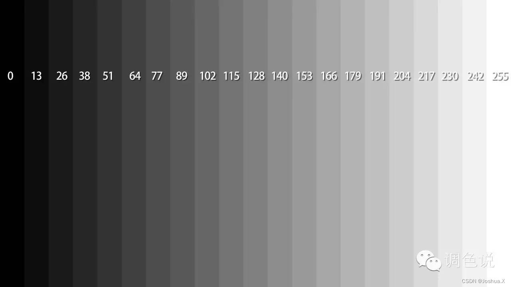
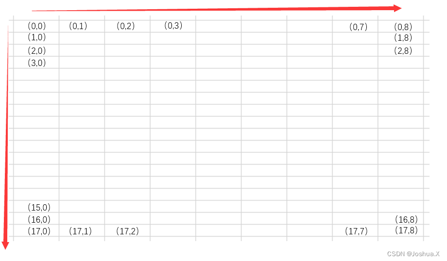
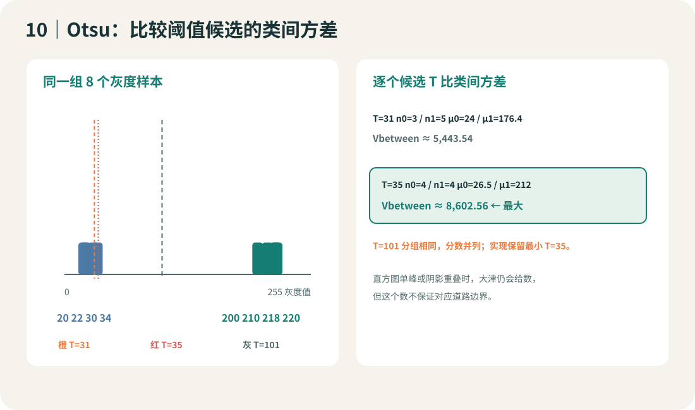
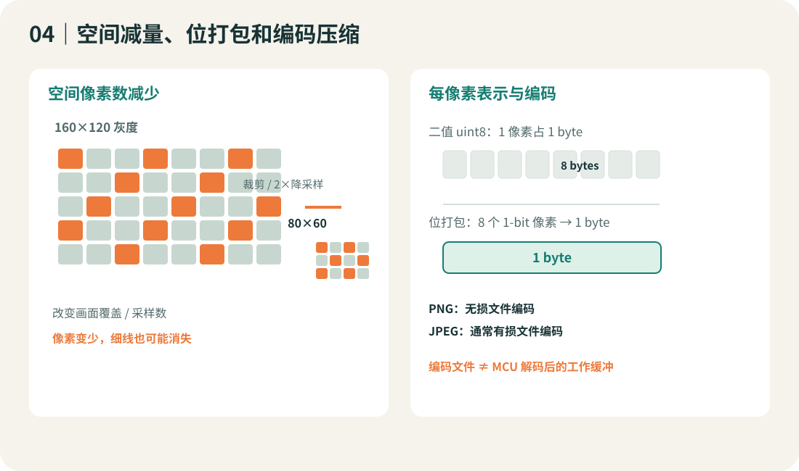
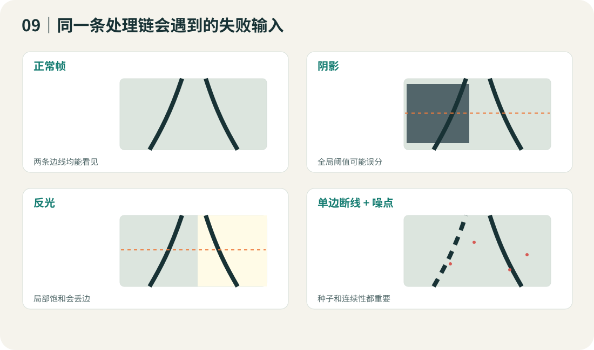
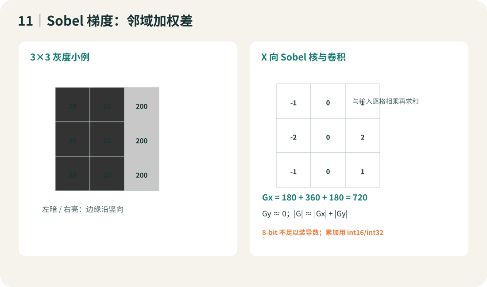
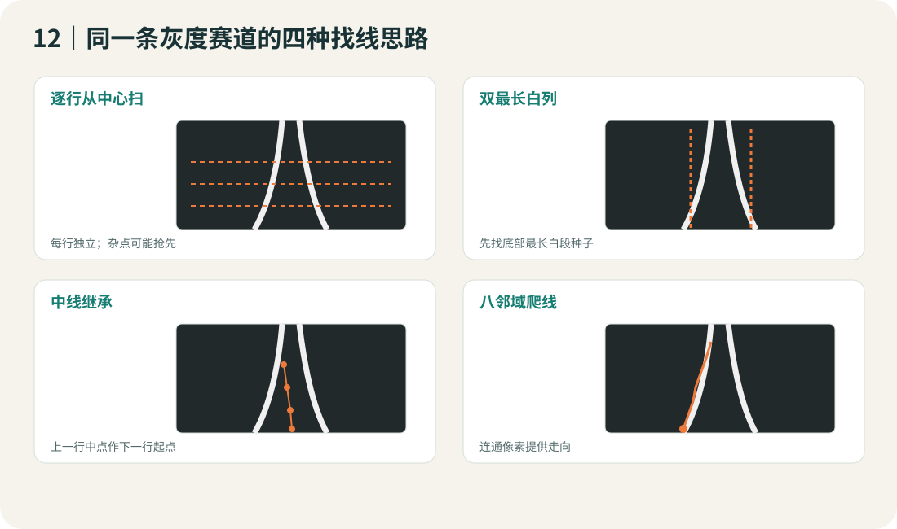
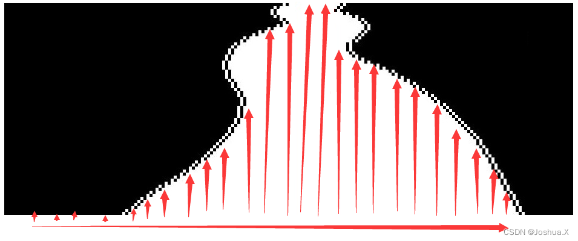
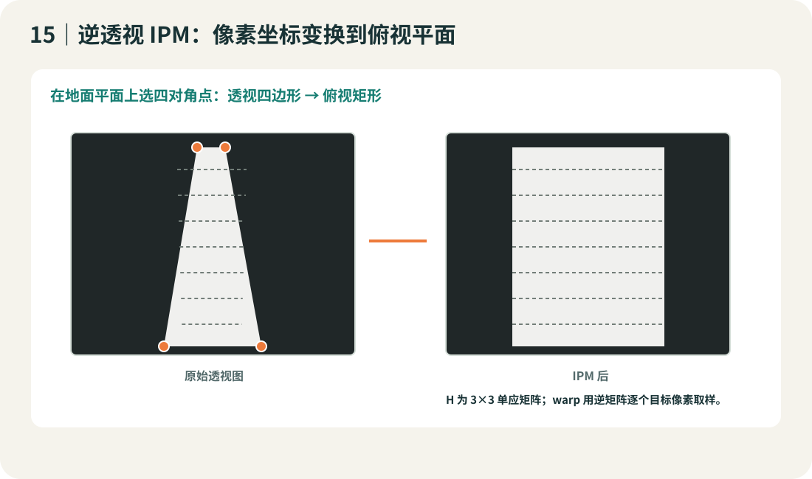

# 图像处理

本培训以总钻风摄像头输出的单通道 GRAY8 为输入，用 C99 从像素数组讲到大津阈值、二值边界、Sobel 阈值边缘、扫线、八邻域和逆透视。课程主线是大津法：理解一帧灰度如何变成直方图、直方图如何决定阈值，以及一次错误分割怎样影响后续图像边界。

课堂重点放在大津法：先看灰度直方图，再按候选阈值把样本分成暗/亮两类，计算类间方差，选出区分两类最明显的阈值。其他算法用于解释大津法何时适用、何时失效，不把算法名堆在一起。

## 学完能做到

- 读懂 GRAY8 二维数组，正确分辨 y 行、x 列、宽 W、高 H 和有效范围。
- 手算固定阈值与大津类间方差，逐个比较候选 T，解释阈值极性和等号约定。
- 写出 C99 直方图/Otsu 实现，比较全图阈值、逐行阈值和局部阈值的取舍。
- 在同一张灰度帧上检查大津阈值，再比较固定/逐行/局部阈值、Sobel 二值边缘、行扫描与边界爬行。
- 用 C99 演示 8 邻域边界爬行和四点 IPM，并估算图像数组和中间缓冲所占 RAM。

## 输入图像约定

整套教程使用 8-bit 单通道数组，取值 0..255。低灰度是暗，高灰度是亮。示例阈值掩码统一规定亮路面为 255 白色前景，暗背景为 0 黑色背景；二值条件使用 I≥T。若实验室灰度极性相反，应先验证一帧再更换比较方向。

~~~c
#define IMG_H 48
#define IMG_W 80
uint8_t gray[IMG_H][IMG_W];
uint8_t mask[IMG_H][IMG_W];
~~~

访问第 y 行第 x 列写作 gray[y][x]。数组宽是列数 W，高是行数 H；合法范围是 x=0..W-1、y=0..H-1。

## 推荐参考链接

- **主参考目录：** [Joshua.Xu 第18届四轮车开源讲解](https://blog.csdn.net/qq_58114029/article/details/131879413)。
- **灰度与大津法：** [第2篇图像处理](https://blog.csdn.net/qq_58114029/article/details/132050763)，适合对照灰度数组、固定阈值、Otsu、Sobel 和图像取样。
- **边界与 IPM：** [第3篇边线提取](https://blog.csdn.net/qq_58114029/article/details/132132607)，适合对照最长白列、中线继承、八邻域和逆透视。
- **公式核对：** [OpenCV 大津与局部阈值文档](https://docs.opencv.org/4.12.0/d7/d4d/tutorial_py_thresholding.html)。

这些 CSDN 文章是第18届历史案例，作者页面声明 CC BY-SA 4.0。相机参数和赛道条件只用于读懂案例，不能直接当成当前实验室设定。图像许可和每条来源的证据位置见 sources.csv。

## 1. 总钻风灰度帧：数组就是第一张“图”

### 1.1 定义和输入/输出

数字图像是一张采样网格。GRAY8 每个采样点用一个无符号 8-bit 数保存：0 是黑，255 是白，中间 254 个值保留明暗层次。像素本身没有“左边线”这个含义；它只告诉我们镜头看到的这片光有多亮。

用户提供的实验室条件是总钻风相机并处理灰度。Joshua.Xu 的历史相机篇和图像篇展示了 MT9V03X 风格的宽×高配置、灰度数组与画面调试。相机型号、分辨率和 SDK 变量以实验室实物为准；这套示例不用任何专有驱动。[相机篇](https://blog.csdn.net/qq_58114029/article/details/132006971) · [图像篇](https://blog.csdn.net/qq_58114029/article/details/132050763)

图示来源：Joshua.Xu，第18届四轮车开源讲解图像篇，CC BY-SA 4.0，原图未修改。此图只示意亮度刻度，不代表本实验室相机的响应曲线。

### 1.2 坐标和越界

把 4 行×5 列矩阵写出来：

~~~text
         x=0  1  2  3  4 →
y=0       20 30 60 90 90
  1       20 30 75 90 90
  2       25 35 180 210 210
  3       25 35 190 220 220
↓
~~~

读 <code>gray[2][3]</code> 是第 2 行、第 3 列，值为 210。行先写，列后写；正确循环是 y 外层、x 内层：

~~~c
for (int y = 0; y < IMG_H; ++y) {
    for (int x = 0; x < IMG_W; ++x) {
        uint8_t pixel = gray[y][x];
        /* pixel 的数值范围是 0..255 */
    }
}
~~~

如果 W=5，合法列号只有 0..4。访问 <code>gray[2][5]</code> 是越界，不是“第六列”。越界会读到不相关 RAM，让算法看似随机变化。博文特别用数组坐标图说明左上角是 (0,0)，而不是数学直角坐标常见的左下角原点。[数组坐标原图](https://blog.csdn.net/qq_58114029/article/details/132050763)

来源：Joshua.Xu，图像篇，CC BY-SA 4.0，原图未修改。程序内部 <code>(x,y)</code> 的写法与数组访问 <code>[y][x]</code> 顺序不同，这是需要记住的常见坑。

### 1.3 成像调试：先看原始灰度，再动算法

相机输出的灰度帧可能出现整体偏亮/偏暗、失焦、运动模糊、暗角、近处丢边或透视过强。处理顺序：

1. 固定车身位置和镜头，保存一张未二值化 GRAY8 帧。
2. 观察全黑/全白像素是否成片出现；全黑或全白通常意味着动态范围已剪裁。
3. 观察直道近端、远端、左右边缘是否都看得见。
4. 调焦、曝光/增益或相机机械角度，每次只改一项并重复采集。
5. 锁定安装后保存基准帧，后续改算法时仍用同一帧回放。

博文中的曝光值、188×120/180×70 分辨率、镜头高度、视野距离都是其特定代次/相机/赛道的个人案例，不是本实验室参数。[相机篇](https://blog.csdn.net/qq_58114029/article/details/132006971)

### 1.4 摄像头帧缓冲的所有权

常见驱动会在一帧采集结束时设置完成标志。完成标志表示“有一帧可处理”，但它不自动保证处理期间 DMA 不会改写原数组。驱动若提供双缓冲/帧锁定接口，优先使用；若只有一块数组，需要确认采集更新时机，必要时把完整帧拷进工作区。不要把简单 flag 当成并发锁。

~~~c
/* 示意接口，不是任何总钻风 SDK 的原样驱动 */
extern volatile uint8_t camera_frame_ready;
extern uint8_t camera_gray[IMG_H][IMG_W];
static uint8_t work_gray[IMG_H][IMG_W];

if (camera_frame_ready) {
    camera_frame_ready = 0;
    for (int y = 0; y < IMG_H; ++y)
        for (int x = 0; x < IMG_W; ++x)
            work_gray[y][x] = camera_gray[y][x];
    /* 之后只处理 work_gray；采集缓冲保护方式仍按实际驱动确认 */
}
~~~

代码解释：第一步读帧完成标志；第二步复制 H×W 字节到稳定的工作帧；后续阈值和扫描使用工作帧。若驱动支持更好的所有权切换，不要在主循环盲目全帧复制。

### 1.5 算法三路

- **基础：** 访问单点、打印 8×8 子阵列和最小/最大灰度值。访问量 O(HW)，帮助查坐标和曝光。
- **进阶：** 统计 256 桶直方图、有效像素比例与逐行均值，用曲线判断明暗是否分成两团。时间 O(HW)，额外直方图空间 256×4 B。
- **横向扩展：** 对整帧做 ROI，只保留相机视野中的道路区域；ROI 减少后续处理像素，但 ROI 外的元素线索永久丢失。

**自测：** 对一个 80×48 GRAY8 帧，原始图像载荷多少字节？若复制一份稳定工作帧，最少总载荷是多少？  
**答案：** 80×48=3840 B；两份为 7680 B，不含行对齐、DMA、栈和驱动内部占用。

### 1.6 用 C 先做一次灰度体检

算法还没开始前，先算最小值、最大值、平均值和每个灰度桶的数量。均值回答“整体有多亮”，直方图回答“亮度分成几群”，两者用途不同。例：像素 [20,22,25,28,190,200] 的最小值是 20、最大值是 200、总和 485、平均约 80.8；均值本身看不出中间有一个很大的暗亮间隔，直方图会把 20 附近和 200 附近分别计数。

~~~c
#include <stdint.h>
#include <string.h>

void gray_histogram(const uint8_t *gray, int width, int height,
                    uint32_t hist[256],
                    uint8_t *min_value, uint8_t *max_value,
                    uint64_t *sum)
{
    const int count = width * height;
    memset(hist, 0, 256u * sizeof(hist[0]));
    *min_value = 255;
    *max_value = 0;
    *sum = 0;

    for (int i = 0; i < count; ++i) {
        const uint8_t value = gray[i];
        ++hist[value];
        if (value < *min_value) *min_value = value;
        if (value > *max_value) *max_value = value;
        *sum += value;
    }
}
~~~

逐句看：每个灰度值直接作为 hist 的下标；uint32 桶计数足以覆盖常见小图，但大图需按最大像素数检查溢出；总和要用更宽的整数，因为上限是 255×H×W。函数每次读一个灰度样本，时间 O(HW)，直方图固定 256 个桶，额外空间 1024 B（uint32 桶）。

可再加一个亮暗端占比指标：统计灰度小于等于 3 的点、以及大于等于 252 的点，分别除以 HW。若两端占比偏高，要回看原帧是否曝光剪裁；阈值算法无法从一排 0 或 255 恢复被相机丢掉的信息。小窗也要逐行看，因为全图均值正常时，画面一侧仍可能过暗。

**横向比较：** 单点最小/最大值最快但容易被孤点影响；均值能描述全图平均但会掩盖分区；直方图保留分布轮廓但不保留像素位置；逐行均值同时保留 y 方向变化，适合发现近端/远端亮度不同。每种统计回答不同问题，不能仅凭一个统计量判定图像“正常”。

 

### 本章自测与答案

1. H=4、W=5 时 gray[2][3] 的行列是什么？合法吗？  
   **答：** 第 2 行、第 3 列；行范围 0..3、列范围 0..4，因此合法。
2. 一帧 min=0、max=255、全图平均值=120，是否一定曝光正常？还要看什么？  
   **答：** 不能据此判断；看 0/255 两端像素占比、分区直方图和原图是否有成片剪裁，少量极值可能只是噪点。
3. 188×120 GRAY8 原始数组的像素载荷是多少？  
   **答：** 188×120=22,560 B；若另复制一份稳定帧，还需至少 22,560 B。具体驱动可能有行跨度、双缓冲和 DMA 占用。

## 2. 大津法：从灰度直方图挑阈值

### 2.1 先定义二值化的输入和输出

输入是一帧 H×W 的 GRAY8 数组，输出是一张同尺寸掩码。本文使用“亮路面为白”的约定：

~~~text
B[y][x] = 255，当 gray[y][x] >= T
B[y][x] =   0，当 gray[y][x] <  T
~~~

固定阈值最容易讲清：每个像素和 T 比较一次。但 T 手工选取后，全图都共用这个界限；若一侧有阴影、另一侧有高光，固定 T 可能一处修好、另一处变坏。大津法的目标是从这一帧的灰度分布自动选一个全图阈值。它并不知道“白色一定是道路”，前景定义仍要由开发者检查。

### 2.2 大津法的直觉：让两类尽量分开

先把每个像素投进 256 个灰度桶，得到直方图 h[0]..h[255]。候选阈值 T 把桶分为：

- 暗类 C0：灰度 0..T-1；
- 亮类 C1：灰度 T..255。

若直方图有暗、亮两个峰，一个好阈值应落在两个峰之间，使两类均值相距远，同时两类都不能小到失去意义。大津法计算每个候选阈值的加权类间方差：

~~~text
w0 = n0 / N                 暗类比例
w1 = n1 / N                 亮类比例
μ0 = 暗类灰度总和 / n0     暗类均值
μ1 = 亮类灰度总和 / n1     亮类均值
Vbetween(T) = w0 × w1 × (μ0 - μ1)^2
~~~

它选 Vbetween 最大的 T。直觉可以这样讲：如果暗类和亮类各自集中、两类中心又隔得远，分数会大；若两类混成一团，分数会小。大津优化的是直方图上的二分类分离，不会识别“赛道语义”，也不会自动排除车壳、阴影或场地外的区域。

### 2.3 手算一组候选：为什么 35 比 31 好

取 8 个像素：20、22、30、34、200、210、218、220，总数 N=8。比较几个候选值：

| T（第一档亮类灰度） | 暗类样本 | 暗类均值 μ0 | 亮类样本 | 亮类均值 μ1 | 类间方差 |
|---:|---:|---:|---:|---:|---:|
| 31 | 20,22,30 | 24 | 34,200,210,218,220 | 176.4 | 约 5443.54 |
| 35 | 20,22,30,34 | 26.5 | 200,210,218,220 | 212 | 约 8602.56 |
| 101 | 同上 | 26.5 | 同上 | 212 | 约 8602.56 |
| 211 | 20,22,30,34,200,210 | 86 | 218,220 | 219 | 约 3316.69 |

T=35 把明显的亮度间隔分开，所以分数大于 T=31。T=35 到 T=200 之间没有新灰度样本改变类别，分数会并列；下面的 C 实现遇到并列时保留先出现的最小 T，因此最终返回 35。这个“第一档亮类灰度”约定与掩码中的 gray>=T 完全一致。若程序改用 gray>T，直方图分组和所有手算边界也必须同步移动一档。

### 2.4 C99：直方图和累积两类统计量

~~~c
#include <stdint.h>

uint8_t otsu_threshold(const uint8_t *gray, int width, int height)
{
    uint32_t hist[256] = {0};
    uint64_t sum_all = 0, sum0 = 0;
    uint64_t total64;
    uint32_t count0 = 0;
    uint32_t total;
    double best_score = -1.0;
    uint8_t best_T = 1;

    if (gray == 0 || width <= 0 || height <= 0) return 1;
    total64 = (uint64_t)(unsigned)width * (uint64_t)(unsigned)height;
    if (total64 > UINT32_MAX) return 1;
    total = (uint32_t)total64;

    for (uint64_t i = 0; i < total64; ++i) {
        ++hist[gray[i]];
        sum_all += gray[i];
    }

    for (int t = 0; t < 255; ++t) {
        count0 += hist[t];                    /* 暗类包括 t */
        sum0 += (uint64_t)t * hist[t];
        const uint32_t count1 = total - count0;/* 亮类从 t+1 开始 */
        if (count0 == 0 || count1 == 0) continue;

        const double w0 = (double)count0 / total;
        const double w1 = (double)count1 / total;
        const double mean0 = (double)sum0 / count0;
        const double mean1 = (double)(sum_all - sum0) / count1;
        const double gap = mean0 - mean1;
        const double score = w0 * w1 * gap * gap;
        if (score > best_score) {
            best_score = score;
            best_T = (uint8_t)(t + 1);         /* 第一档亮类灰度 */
        }
    }
    return best_T;
}
~~~

逐段读这段 C：

1. hist[value] 让灰度值本身成为 0..255 的桶下标；直方图大小固定为 256×4=1,024 B。
2. sum_all 和 sum0 用 64 位整数，避免像素总数很大时灰度累加溢出；count0/count1 记录两类样本数。
3. 外层读图一次，时间 O(HW)；内层只扫描 255 个阈值，不再重复读原图。
4. 空类候选跳过，避免除以 0；score 越大表示这次分割把两类拉得越开。
5. t 表示暗类的最后一个灰度，返回 t+1 才能和 gray>=T 的白色掩码规则对应。
6. best_score 使用严格大于；分数并列时保留先遇到的最小 T，让结果可以复现。

实际程序把 Otsu 阈值交给固定二值化函数，输出 0/255 掩码。固定阈值和 Otsu 都遍历一次每个像素，区别在于 T 是人给的还是直方图选的。完整实现位于 examples/c/image_lab.c。

### 2.5 Otsu 与相邻方法：以同一帧作比较

| 方法 | 阈值怎么来 | 适合的画面 | 常见失效 |
|---|---|---|---|
| 固定 T | 人工给一个灰度数 | 曝光固定、暗亮分布清楚 | 光照变化后同一个 T 失效 |
| Otsu | 对整帧 256 桶直方图找最大类间方差 | 暗背景和亮路面各形成一团 | 阴影/高光让两类重叠；大块无关背景控制整幅阈值 |
| 迭代双均值 | 反复取低/高类均值的中点 | 分布接近两团且两类都出现 | 初值、空类或非双峰分布会不稳 |
| 逐行/局部阈值 | 每行或每个邻域单独算 T | 亮度随图像位置缓慢变化 | 局部窗口含单一类别时容易被带偏，窗口也要调 |

**基础**先用固定 T 把掩码极性、等号和每个像素判断讲清；**进阶**换成 Otsu，让阈值从全图直方图自动挑；**横向扩展**在固定 ROI 上做 Otsu，或者每行分别统计直方图，检验暗角/阴影时是否改善。逐行 Otsu 仍需判断单类行，不能把失败行当成可靠结果。

### 2.6 什么时候大津法会失效

- 直方图只有一个宽峰：画面没有清楚的亮暗两团，大津仍会给一个数，但这个数不一定对应道路边界。
- 大面积阴影和强高光：全图直方图把多个照明区域混在一起，一个 T 无法同时照顾每一行。
- ROI 包含过多无关区域：例如车身、场地外或大面积纯背景占了多数像素，类别权重会被这些像素控制。
- 黑白极性或采集图反相：Otsu只产生阈值；阈值后的白色属于道路还是背景，要检查二值化方向。
- 传感器已经剪裁为大面积 0/255：丢掉的灰度细节不能靠换 Otsu 恢复，先回看原灰度帧。

先看灰度图和 256 桶直方图，再看 Otsu 生成的掩码，最后看扫线。如果只有掩码结果而没有输入分布，初学者很容易把阈值数当作神奇常数。

### 2.7 练习与答案

1. 候选 T 把灰度小于 T 的像素分到暗类。灰度值恰好等于 T 属于哪一类？  
   **答：** 亮类。与 gray>=T 的二值规则一致。
2. 上表中 T=35 和 T=101 的类间方差相同，为什么程序返回 35？  
   **答：** 34 到 199 之间没有样本改变两类分布，分数并列；程序只在分数严格增大时更新，因此保留先遇到的最小 T。
3. 直方图只有一个峰，大津仍然会返回阈值吗？应如何判断结果能不能用？  
   **答：** 会返回一个数；还要检查直方图类间分离、原图亮暗区域、阈值后是否形成连续道路，以及边界是否有效。

**参考：** [Joshua.Xu 图像篇](https://blog.csdn.net/qq_58114029/article/details/132050763) · [OpenCV Otsu 阈值文档](https://docs.opencv.org/4.12.0/d7/d4d/tutorial_py_thresholding.html)

## 3. 降采样、RAM 和滤波

### 3.1 先问清楚“压缩”改了什么

灰度帧有 H×W 个像素，每像素 8 bit。以 160×120 举例：

- GRAY8 原帧：160×120×1 = 19,200 B。
- 另存一个同尺寸 uint8 二值掩码：再要 19,200 B。
- 把二值像素位打包：ceil(19,200/8)=2,400 B。
- 宽高各减半到 80×60 GRAY8：4,800 B。
- 该 80×60 掩码若再位打包：600 B。

双缓冲、DMA 行跨度、Sobel int16 输出、IPM 表、栈和其它任务内存还要另算。这些是数组载荷算术，不等于某块芯片真实可用 RAM。

**空间降采样**减少输出采样位置，会丢窄线/小细节；**位打包**把 8 个 0/1 放在 1 byte 中，二值信息本身可还原但读取要移位；**JPEG/PNG**是文件编码，MCU 解码后仍需工作数组。Joshua.Xu 的历史文章里把隔点取样称作图像压缩，并提醒每次减少采样都会丢细节；本讲义补充区分这三种层面。[图像篇](https://blog.csdn.net/qq_58114029/article/details/132050763)

### 3.2 ROI 与降采样

ROI 是只处理一块区域，例如保留灰度图像的有效道路区域。它减少参与算法的像素，不会自动提高每像素信息。比例降采样常见两种：

- 最近邻：新点取原图最近点，成本低，掩码不会产生新的灰度级，但可能锯齿。
- 区域平均：取一个小块均值，抗混叠更好，但窄亮线会变灰甚至被平均没。

隔点采样 2×：

~~~c
void downsample_2x(const uint8_t *src, int w, int h,
                   uint8_t *dst, int *out_w, int *out_h)
{
    *out_w = w / 2;
    *out_h = h / 2;
    for (int y = 0; y < *out_h; ++y)
        for (int x = 0; x < *out_w; ++x)
            dst[y * *out_w + x] = src[(2 * y) * w + 2 * x];
}
~~~

例：宽 160、高 120，输出宽 80、高 60，主循环只取 4,800 个样本。原相机曾采样过的边缘细节不能由后处理补回来；调分辨率后重测远端最窄赛道线。

### 3.3 3×3 均值、中值和结构元素

对中心像素邻域：

~~~text
 20  20  22
 19 250  21
 20  21  19
~~~

均值是 <code>(20+20+22+19+250+21+20+21+19)/9=45.8</code>，孤立亮噪声把结果拖高。中值排序后取第 5 个，为 20；它对椒盐噪声更稳。若真实路面边缘只有一个像素宽，3×3 中值也可能改变/擦掉它。

C 中值代码：

~~~c
static void median3(const uint8_t *src, uint8_t *dst, int w, int h)
{
    memcpy(dst, src, (size_t)w * h); /* 边界先拷贝 */
    for (int y = 1; y < h - 1; ++y) {
        for (int x = 1; x < w - 1; ++x) {
            uint8_t v[9];
            int n = 0;
            for (int dy = -1; dy <= 1; ++dy)
                for (int dx = -1; dx <= 1; ++dx)
                    v[n++] = src[(y + dy) * w + x + dx];
            for (int i = 1; i < 9; ++i) {
                uint8_t key = v[i];
                int j = i - 1;
                while (j >= 0 && v[j] > key) { v[j + 1] = v[j]; --j; }
                v[j + 1] = key;
            }                       /* 9 个数插入排序 */
            dst[y * w + x] = v[4]; /* 中位数 */
        }
    }
}
~~~

将 uint8 掩码做形态学腐蚀会缩小白色前景，膨胀会扩大前景；开运算（先腐蚀再膨胀）倾向去除小白点，闭运算（先膨胀再腐蚀）倾向填小黑孔。结构核尺寸越大，去噪越强，但细边也越容易改变。示例程序含 3×3 中值；形态学留作扩展练习，不能对已丢失的长断线无依据地补边。

### 3.4 三路比较

- 基础：中值 3×3，处理孤点，邻域排序开销更高。
- 进阶：可分离高斯用于连续小幅噪声，横纵两次一维卷积；边缘会变软。
- 横向：行缓存和位打包减少中间存储；需要记录每行/像素的读写生命周期。

**练习：** 320×240 GRAY8 双缓冲需要多少字节？二值 uint8 和 1-bit mask 各多少？  
**答案：** 一张 GRAY8 76,800 B，双缓冲 153,600 B；二值 uint8 76,800 B；位打包 ceil(76,800/8)=9,600 B。

**参考：** [Joshua.Xu图像篇](https://blog.csdn.net/qq_58114029/article/details/132050763) · [OpenCV平滑滤波](https://docs.opencv.org/4.13.0/dc/dd3/tutorial_gausian_median_blur_bilateral_filter.html) · [OpenCV几何缩放](https://docs.opencv.org/4.12.0/da/d6e/tutorial_py_geometric_transformations.html)

### 3.5 同一输入做区域平均的替代采样

examples/c 的基线演示采用最近邻隔点采样，便于直观看到空间信息减少。下面是可横向测试的 2×2 区域平均版本：它会把一个 2×2 块合成一个亮度。要求宽高为偶数；若实际尺寸为奇数，输出只处理完整块或在上层明确 padding，不能静默越界。

~~~c
void downsample_average_2x(const uint8_t *src, int width, int height,
                           uint8_t *dst)
{
    const int out_w = width / 2;
    const int out_h = height / 2;
    for (int y = 0; y < out_h; ++y) {
        for (int x = 0; x < out_w; ++x) {
            const int sx = 2 * x;
            const int sy = 2 * y;
            const unsigned sum =
                src[sy * width + sx] + src[sy * width + sx + 1] +
                src[(sy + 1) * width + sx] + src[(sy + 1) * width + sx + 1];
            dst[y * out_w + x] = (uint8_t)((sum + 2u) / 4u);
        }
    }
}
~~~

四个灰度样本 20、20、20、220 的平均约 70；最近邻若恰好取左上角，则输出 20。平均法降低一个孤立亮点的影响，但如果那一个亮点是真正只有一像素宽的赛道标记，也会把它稀释。因此下采样必须与目标物体最小宽度一起设计，并在相机原尺寸与缩小版本并排比较。

### 3.6 二值位打包：把 8 个逻辑像素收进一个字节

位打包不改变图像宽高和前景判断，只改变存储表示。下列代码按行优先，把第一个逻辑像素放在字节的最高位；最后不足 8 位的尾字节补 0。解包时必须使用相同位序。

~~~c
size_t pack_mask(const uint8_t *mask, size_t pixels,
                 uint8_t *packed, size_t capacity)
{
    const size_t bytes = (pixels + 7u) / 8u;
    if (capacity < bytes) return 0u;
    memset(packed, 0, bytes);
    for (size_t i = 0; i < pixels; ++i) {
        if (mask[i] != 0u)
            packed[i >> 3] |= (uint8_t)(1u << (7u - (i & 7u)));
    }
    return bytes;
}
~~~

当 i=0 时，i>>3 是第 0 字节、i&7 是第 0 位，所以写入 bit 7；i=7 写入 bit 0；i=8 开始下一个字节。容量检查必须在写入前完成。掩码约定 0/255 或 0/1 都可，判断条件只要求非零。C 仿真生成的 PGM 仍是每像素一个 byte，pack_mask 单独打印紧凑载荷大小，二者不要混为同一种文件格式。

### 3.7 滤波不是“越平滑越好”

| 算法 | 输入与运算 | 擅长 | 会损失什么 |
|---|---|---|---|
| 均值 | 邻域求和再除以点数 | 随机小幅噪声 | 边缘变软、孤立异常会拉动均值 |
| 中值 | 邻域排序取中间样本 | 单点黑/白椒盐噪声 | 细线、尖角会被改形 |
| 高斯 | 距离中心近的样本权重更高 | 连续噪声，便于分离频率 | 梯度幅值下降，仍会模糊边缘 |
| 腐蚀/膨胀 | 看结构核内是否全白/至少一点白 | 擦小白点、补小黑洞 | 道路变窄或变宽，间隙会闭合 |

先确定掩码里哪个类别是“前景”，再说开闭运算。对亮路面为白色的约定，开运算容易清小白噪点但也可能切断窄路面；闭运算可以补小黑洞却也可能把两条邻近白线粘起来。窗口大小不能脱离线宽和图像分辨率调。

 

### 本章自测与答案

1. 160×120 GRAY8 缩小到 80×60 后是多少字节？与原图相比减少多少比例？  
   **答：** 80×60=4,800 B；原来 19,200 B，载荷减少 75%，同时空间采样数也减少 75%。
2. 3×3 中值邻域有一个值为 250，其余值在 19..22；为什么中值仍接近 20 而均值明显变大？  
   **答：** 中值只看排序后的中间位置，单个极值排在末端；均值把 250 加入总和，所以被拉高。
3. 位打包与 JPEG/PNG 文件编码的差异是什么？  
   **答：** 位打包按每 8 个二值像素合存 1 byte，逻辑掩码可以无损还原；JPEG/PNG 是文件表示/编码，解码后的图仍要占工作数组，JPEG 通常会有损。

## 4. Sobel：从灰度变化到边缘候选

### 4.1 定义：边缘是“亮度变化很快”的位置

灰度图只给每个位置一个亮度 I(x,y)。如果横着挪一格，亮度变化很大，说明附近可能有一条近似竖向的边；如果竖着挪一格变化很大，附近可能有近似横向的边。这个局部变化率叫梯度。梯度方向指向亮度增加最快的方向；边缘本身大致与梯度方向垂直。

离散的一阶差分可以先用两个像素理解：

~~~text
横向：Gx ≈ I(x+1,y) - I(x-1,y)
纵向：Gy ≈ I(x,y+1) - I(x,y-1)
梯度强度：M ≈ |Gx| + |Gy|
~~~

差分只看两点，噪点会立刻放大。Sobel 用 3×3 邻域，并让中间一行/列的权重更大，近似微分时顺便做一点平滑。

### 4.2 卷积核和手算

X 核：

~~~text
-1   0  +1
-2   0  +2
-1   0  +1
~~~

Y 核是把 X 核转置。把输入小窗逐格乘权重再相加：

~~~text
输入 I              X 核             相乘求和
20  20 200          -1 0 +1          -20 + 0 + 200
20  20 200   ×      -2 0 +2     =    -40 + 0 + 400   = 720
20  20 200          -1 0 +1          -20 + 0 + 200
~~~

所以 Gx=720，Gy=0。因为左暗右亮，梯度朝右，边缘大致竖直。结果 720 超过 uint8 最大值 255；不能直接塞入 uint8，否则会截断/回绕。卷积暂存用 int16 或 int32，显示时再缩放。OpenCV 的 Sobel 教程也使用有符号较高精度中间结果，之后才转为 8-bit 显示。[Sobel 官方说明](https://docs.opencv.org/4.12.0/d2/d2c/tutorial_sobel_derivatives.html)

### 4.3 C99：处理一个像素，再扩展到整帧

下面按 examples/c/image_lab.c 的处理方式演示：Gx/Gy 只作为 int 临时量参与计算；幅值缩放后立刻送去阈值判断。教学程序只把最终的 0/255 黑白边缘掩码保存为 Sobel 图，不把 Gx、Gy 或连续灰度幅值当作实验输出。

~~~c
static void sobel_pixel(const uint8_t p[3][3],
                        int *gx_out, int *gy_out, int *mag_out)
{
    int gx = -p[0][0] + p[0][2]
           - 2 * p[1][0] + 2 * p[1][2]
           - p[2][0] + p[2][2];
    int gy = -p[0][0] - 2 * p[0][1] - p[0][2]
           + p[2][0] + 2 * p[2][1] + p[2][2];

    *gx_out = gx;
    *gy_out = gy;
    *mag_out = abs(gx) + abs(gy);
}

/* 对整帧：边缘一圈缺少完整 3×3 邻域，教学版将它置黑。 */
static void sobel_threshold_frame(const uint8_t *src, uint8_t *edges,
                                  int width, int height, int threshold)
{
    memset(edges, 0, (size_t)width * height);

    for (int y = 1; y < height - 1; ++y) {
        for (int x = 1; x < width - 1; ++x) {
            const uint8_t p[3][3] = {
                {src[(y-1)*width+x-1], src[(y-1)*width+x], src[(y-1)*width+x+1]},
                {src[y*width+x-1],     src[y*width+x],     src[y*width+x+1]},
                {src[(y+1)*width+x-1], src[(y+1)*width+x], src[(y+1)*width+x+1]}
            };
            int gx, gy, mag;
            sobel_pixel(p, &gx, &gy, &mag);
            const int scaled_magnitude = mag / 8;
            edges[y * width + x] = (scaled_magnitude >= threshold) ? 255 : 0;
        }
    }
}
~~~

读代码时逐项问：

1. p[0][0] 是中心点左上角；数组索引仍然是先 y 后 x。
2. X 核右半边是正权重、左半边是负权重；均匀区域相互抵消，跨过明暗阶跃时差值变大。
3. Y 核比较下半部与上半部；水平亮度阶跃时 Gy 大。
4. 把梯度写进 int，而不是 uint8_t，因为梯度有正负且绝对值可大于 255。
5. 图像边缘无法取完整 3×3 邻域；最简单办法是把一圈输出设为 0，也可在实际程序用复制边界/镜像边界，但必须统一说明。

上面演示了单点和整帧。嵌入式版本通常不需要分别保留 gx_view、gy_view、mag_view 三张显示图；可在处理当前点时立刻阈值化，并用行缓存复用内存。课程实验最终只展示黑白边缘图，梯度中间值用于理解和计算，不作为额外结果图。

### 4.4 从幅值到一像素宽的边缘

最简单边缘掩码是：

~~~c
edge[i] = (magnitude[i] >= threshold) ? 255 : 0;
~~~

阈值太低，路面纹理和噪点也变边；阈值太高，弱边缘断开。Sobel 输出通常是一条有宽度的响应带，不是最终的“赛道边线”。一个横向扩展是 Canny 思路：

1. 用小高斯核压低孤立噪声。
2. Sobel 算 Gx、Gy 和方向。
3. 沿梯度方向做非极大值抑制，只保留局部最强像素。
4. 用低/高双阈值分成强边和弱边。
5. 从强边开始沿 8 邻接接纳相连弱边，直到队列为空。

examples/c 的 canny_simple() 把步骤压成教学实现，方向只量化成少数方向，边缘队列使用固定上限；它说明流程，不等同于 OpenCV 的完整 Canny 或经过赛道数据验证的检测器。[Canny 官方步骤](https://docs.opencv.org/4.12.0/da/d5c/tutorial_canny_detector.html)

### 4.5 三条边缘路线的比较

| 路线 | 做法 | 好处 | 常见代价/失效 |
|---|---|---|---|
| 基础：两点绝对差 | 比较指定行上的相邻灰度 | 直接、内存小，容易解释跳变 | 只沿选定方向取样；阴影边也会有强跳变 |
| 进阶：Sobel | 3×3 卷积近似二维梯度，再阈值 | 同时观察 x/y 变化，方向有含义 | 会把纹理和噪点当边；幅值带较厚 |
| 横向扩展：Canny/局部极值 | 平滑、细化、双阈值连边 | 线条较细，弱边可沿强边连接 | 阶段多、工作缓冲大；断裂/分叉仍需再判断 |

复杂度：整帧 Sobel 对每个有效像素计算固定数量的乘加，时间 O(HW)。两个 int16 梯度面约 4HW 字节；只保留一行 3-row 窗口可显著降低临时存储，但需正确处理行更新。Canny 教学版本额外有梯度、抑制结果与像素队列，最坏队列长度和访问标记与 HW 同阶。

**失败诊断：** 若输入边界已经在灰度图里饱和成一片白，Sobel 无法恢复消失的纹理；若相机失焦，边缘峰值会变低且变宽；若压缩块纹理明显，会出现规则伪边。先检查原灰度输入，再调阈值并观察边缘像素是否连续、是否把纹理也保留下来。

**练习：** 输入三行分别为 30 30 180 / 30 30 180 / 30 30 180。算中心 Gx、Gy，并说明边缘朝向。  
**答案：** Gx=600，Gy=0；左暗右亮，梯度向右，边缘线大致竖直。  
**参考：** [Joshua.Xu 图像篇中的 Sobel 教学案例](https://blog.csdn.net/qq_58114029/article/details/132050763) · [OpenCV Sobel](https://docs.opencv.org/4.12.0/d2/d2c/tutorial_sobel_derivatives.html) · [OpenCV Canny](https://docs.opencv.org/4.12.0/da/d5c/tutorial_canny_detector.html)

### Sobel 加练两题

2. 3×3 区域全是灰度 80。中心 Gx、Gy 和幅值各是多少？  
   **答案：** Gx=0、Gy=0、幅值=0；按可视化偏置输出时 gx_view/gy_view 为 128，幅值仍是 0。
3. Sobel 幅值超过阈值是否就证明这里是道路边缘？  
   **答案：** 不能；阴影、反光边缘和纹理都会产生高响应。阈值化只留下局部灰度变化候选，还要结合连续边线与当前图像区域判断。

## 5. 扫线：把掩码变成边界坐标

这章的输入是二值掩码：亮路面=255，暗背景=0。输出是每行的左边界 L[y]、右边界 R[y]、有效标志和路宽 W[y]=R[y]-L[y]。所有算法都用同一帧对比，避免拿不同画面比较算法。

### 5.1 逐行从中间向两边扫描

每一行从上次中点（第一行用画面中心）向左/右找“白路面到黑背景”的跳变。

~~~text
x:  0 1 2 3 4 5 6 7 8
行:  0 0 0 1 1 1 1 0 0
             ↑       ↑
             L       R
~~~

左边界检查 <code>mask[x]==255 && mask[x-1]==0</code>；右边界检查 <code>mask[x]==255 && mask[x+1]==0</code>。必须先检查 x>0 或 x<W-1，避免邻居读越界。

~~~c
EdgePair scan_row(const uint8_t *row, int width, int start_x)
{
    EdgePair e = {-1, -1, 0};
    if (start_x < 1 || start_x >= width - 1) start_x = width / 2;
    for (int x = start_x; x > 0; --x) {
        if (row[x] == 255 && row[x - 1] == 0) { e.left = x; break; }
    }
    for (int x = start_x; x < width - 1; ++x) {
        if (row[x] == 255 && row[x + 1] == 0) { e.right = x; break; }
    }
    e.valid = (e.left >= 0 && e.right > e.left);
    return e;
}
~~~

解释：扫描方向是从假定在白路面内的种子向外走；发现白→黑第一跳就锁定本行边界；两边都有才设 valid。遇到白噪声斑点、反光断带或交叉路口时，“第一跳”可能不是道路边界。每行全宽搜索最坏 O(HW)；种子足够准且单行搜索半径 r 时约 O(Hr)。

### 5.2 双最长白列：先估搜索截止行

Joshua.Xu 的第18届教程先从每列最下面开始向上数连续白点，再从图像左右分别取最长列作为左右搜索种子。最长白列长度也被用作“搜索截止行”估计：白路面一直延伸到远处，边界搜索就能上溯得更远；视野短/弯道急时截止行会变浅。[来源原图](https://blog.csdn.net/qq_58114029/article/details/132132607)

算法模拟：

1. 对每列 x，从 y=H-1 向 0 累加连续 255 的长度。
2. 左到右遍历取最大长度和列号；右到左同理，使长度相同的平坦赛道可得到两侧种子。
3. 从近端往远端扫描，只处理截止行内的行；左右分别从种子列搜边界。
4. 记录每行丢左边/丢右边标志；不能把画面边缘伪装成有效边。

其优点是把下一步搜线起点放在路面内部；缺点是平坦区存在很多并列白列、阈值掩码的噪点会改变最长长度、十字/环岛会让“白列一直向上”不再代表可用视野。将起始 ROI 和终止行限制标定到真实灰度帧。

### 5.3 中线继承：从一行结果给下一行种子

从近端 y=H-1 开始，用图像中心找左右边界，得 <code>mid=(L+R)/2</code>；上一行 mid 作为下一行的起点，重复向上。局部搜索可少看像素，也能沿着弯道走；但若某行错误，下一行可能继承错误。必须同时保存 valid 与边界距离，失效时回到中心或最近有效行，不能永远传递旧中线。

### 5.4 方向扫线与灰度直接扫线

二值扫线比较白/黑状态；灰度扫线可直接比较相邻像素绝对差。对每行在起点两边找超过局部灰度差门槛的位置，可暂时省去整幅二值图缓冲，但阈值仍需检查噪点和光照变化。Joshua.Xu 的边线文章列出最长白列、中线继承、八邻域、迷宫和逆透视等路径；每种方法都依赖输入质量和有效停止条件。[边线提取篇](https://blog.csdn.net/qq_58114029/article/details/132132607)

### 5.5 同帧比较表

| 方法 | 种子 | 找线方向 | 额外状态 | 典型失败 |
|---|---|---|---|---|
| 每行从中心扫 | 每行固定中心 | 水平左右 | 每行有效位 | 假种子、噪点先跳 |
| 双最长白列 | 底部连续白段 | 竖直估范围，再水平找边 | 每列长度、左右种子 | 多个最长列打平、远端断裂 |
| 中线继承 | 上一行中点 | 从近向远水平扫 | 上一行中点+有效位 | 错误中线逐行传播 |
| 灰度跳变扫 | 中心或上一行点 | 比较 a 与 a+δ | 灰度阈值、极性 | 灰度渐变太缓/暗部噪声放大 |

**算法开销：** 二值掩码 H×W 字节；每行左右坐标和 valid 各用少量 H 长数组。扫描全图最坏 O(HW)。最长白列先逐列数一次连续长度，再限制有效行，通常仍为 O(HW)，但会减少第二轮边界搜索区域。

**练习：** 掩码一行 <code>0 0 255 255 255 0 0</code>，从中间 x=3 搜两边，L/R 为何？如果把 x=2 变成 0 会怎样？  
**答案：** L=2、R=4；x=2 变黑后，L=3，但赛道宽度被低估，因此还要做邻域连续性或多阈值检查。

### 5.6 最长白列的 C 仿真和逐行回退

考虑一幅只有 4 行、7 列的掩码，1 表示白色路面：

~~~text
y=0  0 0 0 0 0 0 0
y=1  0 0 1 1 1 0 0
y=2  0 1 1 1 1 1 0
y=3  1 1 1 1 1 1 1
     x=0             x=6
~~~

从底向上数连续白点：x=0、6 各只有 1 个；x=1、5 各 2 个；x=2、4 各 3 个；x=3 有 4 个。左向搜索种子是 x=3，右向搜索种子也是 x=3。最大共同连续深度为 4 行，所以这幅小例子的四行都可继续逐行搜索。这个例子故意是直线；真实弯道左右最长列可能不同，且多个列可能打平。

完整 C 仿真函数在 examples/c/image_lab.c 的 longest_white_seeds() / scan_longest_column()。核心步骤等价于：

~~~c
for (int x = 1; x < width - 1; ++x) {
    int run = 0;
    for (int y = height - 1; y >= 0 && binary[y][x] == 255; --y)
        ++run;
    if (run > best_left) { best_left = run; left_seed = x; }
}

/* 教学程序随后取左右种子的中点，作为每行左右扫边的共同起点。 */
int start_x = (left_seed + right_seed) / 2;
for (int y = height - 1; y >= height - stop_rows; --y) {
    EdgePair p = scan_row_from_center(binary, y, start_x);
    left[y] = p.left;
    right[y] = p.right;
    valid[y] = (uint8_t)p.valid;
    if (p.valid) start_x = (p.left + p.right) / 2;
}
~~~

逐行读：内部列跳过 x=0/W-1，给邻接边留空间；外层 y 从底向上，连续白像素数遇到黑点就停止；严格大于 best 时更新，这表示并列时保留先遇到的列，结果依遍历顺序而定。真实项目也可以让左、右种子分别引导各自的扫描，但这份 C 程序为了和中线继承对比，先把两个种子合成中心，再逐行更新。

### 5.7 一行结果如何传给下一行

对下列 9 个像素，从 x=4 出发，左右第一跳得到 L=2、R=6，中点为 4：

~~~text
0 0 255 255 255 255 255 0 0
      L       seed  R
~~~

下一行道路整体向右偏 1 像素时，中线继承把 seed 更新到 5，可以只在 5 左右的小窗口搜索。若下一行左右扫描都未找到跳变，就把 valid 置 0，并保留本行的“未知”状态；不能把 -1 默认为屏幕边缘，也不能把上一行边界伪装成本行的观测。允许从上一有效行短暂补线时，需同时保存“补了几行”，达到上限后回到宽搜索或标记整段无效。

### 5.8 行扫描、列扫描与连通扫描不是同一问题

- 行扫描回答“在某个高度，路面横向在哪里？”直接产生左右边界。
- 最长白列回答“从图像底部往上，哪些位置的前景连续得远？”它可产生种子和可扫描范围，不直接输出全套边界。
- 八邻域回答“从种子出发，哪些像素与它连通、下一步向哪里走？”它输出路径/连通区域，需要另做左右语义判断。

把这三种输出混着画，会让新生以为“找到了所有白点”就等于“找到了路”。课堂演示时要在同一张阈值掩码上分别画扫描线、每列连续长度和连通路径，再点选失败位置。

 

### 本章自测与答案

1. 一行掩码为 [0,0,255,255,255,0,0]，从 x=3 向左右搜索，左右边界是什么？  
   **答：** L=2、R=4；中点为 3。
2. 中线继承在第 8 行误把噪点当成右边界后，接下来要记录什么以避免连续误传？  
   **答：** 保存每行左右点、有效标志、搜索半径/失边状态；无效时回到较宽搜索或标记未知，不能无条件继承。
3. 双最长白列输出的“连续白点长度”能否直接当作地面距离？  
   **答：** 不能。像素 y 与地面距离的映射受透视和相机姿态影响；长度只是在当前二值图上的连续列数。

## 6. 八邻域与迷宫式边界跟踪

### 6.1 邻域、种子和方向

八邻域是中心像素周围八个格子。约定编号顺时针：

~~~text
7 NW   0 N   1 NE
6 W     P    2 E
5 SW   4 S   3 SE
~~~

输入可以是二值道路边界或 Sobel 边缘图。先找一个真的边缘种子 (x0,y0)，再记住进入方向。每一步从上一步的邻方向开始按固定顺序访问八格，移到相连的下一个边缘像素，并记录坐标与方向。

### 6.2 逐步模拟

下面 5×7 网格是一段折线边缘，P 是种子；箭头代表当前向右上的生长方向：

~~~text
.......
....**.
...*.*.
..P*...
.......
~~~

第一次读中心周围 8 格，若顺时针检查在 NE 找到边缘，就移动到 NE；下一次从 NE 的邻方向继续搜。把路径写成坐标序列后可检查是否跳到了另一条边：

~~~text
(2,3) → (3,3) → (3,2) → (4,1) → (5,1)
~~~

这里坐标仍是 x 列、y 行。八邻域找到的是“连着的前景”，不自动判断这个前景是否为赛道左边线；种子错误、阈值错误或分支选择错误，都可能让轨迹沿着噪点跑。

### 6.3 停机条件不可以省略

只要每一步沿 8 邻域找前景，没有停止规则就可能在闭合边界里无穷循环。至少设置：

- 有界图像坐标检查，越界邻点不能回卷到另一侧。
- 访问标记或状态哈希，记录 (x,y,entry_direction)；只记录 x/y 会把交叉口误判成完整闭环。
- 最大步数 H×W 或更小的策略上限。
- 没有可走邻点、有效终点、闭环回到起始状态时有明确定义的结果。

C99 教学核心：

~~~c
static const int dx[8] = {0,1,1,1,0,-1,-1,-1};
static const int dy[8] = {-1,-1,0,1,1,1,0,-1};

for (int step = 0; step < H * W; ++step) {
    visited[y][x] = 1;
    int found = 0;
    for (int k = 0; k < 8; ++k) {
        int d = (entry_dir + 6 + k) & 7;
        int nx = x + dx[d], ny = y + dy[d];
        if (nx >= 0 && nx < W && ny >= 0 && ny < H &&
            edge[ny][nx] && !visited[ny][nx]) {
            x = nx; y = ny; entry_dir = (d + 5) & 7;
            found = 1; break;
        }
    }
    if (!found) break;   /* 端点/死路 */
    if (x == start_x && y == start_y && step > 7) break; /* 闭环 */
}
~~~

代码里的访问优先顺序是一种教学选择。文章/仓库里的八邻域和迷宫实现可能有不同的入边定义、旋转方向和分支策略，要逐一确认后再比较，不能只看算法名字。

### 6.4 迷宫法和广度遍历的关系

“迷宫法巡边”在智能车文章里通常指携带前进方向、按墙边规则选择下一个邻格的边界跟随，不等于任意网格上的 BFS 最短路径。它更容易利用“沿一侧边界继续走”的局部结构，但前提是墙/前景连通、没有断口且有闭环状态。

本主题的算法路线是：**基础**用 3×3 邻点表找一个相邻前景像素；**进阶**记住进入方向、访问状态与闭环终止；**横向扩展**改用全图 DFS/BFS 连通域，或回到逐行扫描直接输出 L[y]/R[y]。第一种回答“下一步往哪走”，第二种回答“这个连通区域由哪些点组成”，第三种回答“每个高度的左右边界在哪里”，不能把输出当作同一个东西。

| 路线 | 每步工作 | 内存 | 擅长 | 风险 |
|---|---|---|---|---|
| 八邻域跟踪 | 检查最多 8 邻点 | visited 可为 1bit/像素或方向状态 | 连续边缘，输出生长方向 | 岔路/闭环会选择错或绕圈 |
| 迷宫/墙跟随 | 按方向顺序找邻点 | 当前点、方向和少量访问标记 | 结构连续边界 | 断线、双边粘连、种子错误 |
| 全图连通域 | 每个像素最多入队一次 | 标签/队列可达 O(HW) | 多个候选先按面积筛 | MCU 队列开销，仍需语义筛选 |

本章网站演示器可拖动“已访问步数”，看同一条链的访问状态、停机上限和断线点。程序模拟不等于某个总钻风硬件上的速度实测。

**参考：** [Joshua.Xu 边线提取篇](https://blog.csdn.net/qq_58114029/article/details/132132607)（CC BY-SA 4.0，历史案例）· [八邻域视频链接](https://www.bilibili.com/video/BV1VN411N79B/)（仅核验元数据，内容未作事实依据）

### 6.5 方向状态如何避免岔路误判

同一个像素可能从不同方向进入，下一次优先检查的邻点也会不同。因此更严格的访问状态是 (x,y,entry_direction)，不是只有 x/y。可把状态压成索引：<code>((y×W+x)×8+d)</code>；最坏需要 8HW 个访问标志。如果按 byte 存，空间上界 8HW B；用位图约为 HW B。小型课程演示可以只标记已访问像素并设置 HW 步数上限，但它可能在闭环尚未完成时提前停止。

本仓库的 trace_8_neighbor() 正是这种保守教学版：保留 start pixel、当前方向和访问图；遇到没有新邻点就停止，最多走 H×W 步。它避免死循环，却不保证完整复原闭合边界。真实闭环检测应保存“位置+方向”状态，或检测回到起点且入边方向也匹配；在交叉口要定义优先选路策略，不能把终止条件交给偶然的数组访问顺序。

~~~c
/* 方向状态版的访问索引；实际路径策略还要定义分叉优先级。 */
size_t state = ((size_t)y * width + (size_t)x) * 8u + (size_t)entry_dir;
if (visited_state[state]) {
    /* 同一个位置和进入方向再次出现：检测到重复状态，可终止或输出闭环 */
}
visited_state[state] = 1u;
~~~

### 6.6 八邻域手动走一遍

把每一步写成小表格比盯着整幅图更容易找 bug：

| 步 | 当前坐标 (x,y) | 上一步方向 | 按序检查 | 下一个点 |
|---:|---|---|---|---|
| 0 | (2,3) | N | NE → E → SE… | (3,3) |
| 1 | (3,3) | E | SE → S → SW… | (3,2) |
| 2 | (3,2) | N | NE → E → SE… | (4,1) |
| 3 | (4,1) | NE | E → SE → S… | (5,1) |

表中只是假定这些位置是边缘像素的人工示例，用来演练方向更新；真实程序必须对每个候选检查图像边界、像素是否属于边缘、是否已访问。方向数组的编号顺序若改为逆时针，方向更新常数也要一起改，否则路径会突然跳到另一侧。

### 6.7 与全图遍历比较

如果目的只是沿一段已知连续轮廓前进，局部八邻域每一步最多检查 8 个像素，时间与路径长度 P 成正比，额外空间取决于 visited。若目的是把全图所有连通白区都找出，应使用连通域/DFS/BFS：每个像素最多入队或标记一次，时间 O(HW)，但队列最坏也可能占 O(HW)。行扫描则针对每个 y 找两个横向跳变，写成 L[y]/R[y]，不需要追踪每个边缘像素。

“迷宫法”通常是带方向的边界跟随策略，不自动等同于 BFS 最短路径。边界跟随能沿墙面连通性走，但如果目标不是一个闭合、连通、无岔路的边缘，墙跟随也会绕错。论文/博文/开源项目里的入边记号不同，复现时需要把 3×3 编号、转向优先级、停止条件和像素极性逐项列出。

 

### 本章自测与答案

1. W=80、H=48，位置 (x=4,y=2)、方向 d=3 的状态线性索引是多少？  
   **答：** ((2×80+4)×8+3)=1,315。
2. 为什么只把访问标记做成 visited[y][x]，可能不能正确区分交叉口状态？  
   **答：** 同一像素可以由不同方向进入，后续邻点优先顺序不同；严格状态还要包含 entry_direction。
3. 在 80×48 上，简单步数上限 H×W 是多少？全图连通搜索和沿已知路径八邻域各自回答什么？  
   **答：** 上限 3,840 步；连通搜索找全图可达区域，沿线八邻域从一个种子追踪边界路径。

## 7. 逆透视 IPM：从相机梯形到俯视网格

### 7.1 先理解变换的目标

相机俯视地面时，远处路面通常占较少的像素宽度；IPM (Inverse Perspective Mapping) 把近似平面的地面做投影变换，得到便于按行比较的鸟瞰图。它变换的是几何坐标，不会新增摄像头没有采到的细节；坡面、起伏和相机动了之后，单一平面模型会失准。

### 7.2 四点对应与 3×3 单应矩阵

给原图地面平面四点 <code>(x,y)</code>，对应到鸟瞰图四点 <code>(u,v)</code>。以 <code>h8=1</code> 固定尺度：

~~~text
u = (h0*x + h1*y + h2) / (h6*x + h7*y + 1)
v = (h3*x + h4*y + h5) / (h6*x + h7*y + 1)
~~~

未知量 h0..h7 共 8 个，每对点提供关于 u、v 的两条线性方程。四对点组成 8×8 方程组。矩阵可解后得到 H；需要从目标鸟瞰像素取源灰度时，使用 H 的逆矩阵做逆向映射，避免只向前投影产生空洞。

### 7.3 C99 实现框架

~~~c
/* source[] 与 target[] 含 4 对地面点，solve8x8 使用部分主元高斯消去 */
int homography_from_quad(const Point2f source[4],
                         const Point2f target[4], float H[3][3])
{
    float A[8][9] = {{0}};
    build_eight_equations(source, target, A);
    float h[8];
    if (!solve8x8(A, h)) return 0;  /* 点退化/近共线 */
    for (int k = 0; k < 8; ++k) H[k / 3][k % 3] = h[k];
    H[2][2] = 1.0f;
    return 1;
}
~~~

实际变换每个目标像素需反算源位置，检查分母、边界，再用最近邻或双线性插值取 gray 值。examples/c/image_lab.c 实现了 4 点方程、求解、3×3 求逆和最近邻 warp，并保存 13_ipm.pgm；公式和绘图均为独立 C99 写法。OpenCV 也提供 getPerspectiveTransform/warpPerspective 作 API 对照，但本教材不用 OpenCV 代码运行核心实验。[OpenCV 几何变换](https://docs.opencv.org/4.12.0/da/d6e/tutorial_py_geometric_transformations.html)

### 7.4 标定步骤与失败检查

1. 固定相机支架、焦距和俯仰角；在平整地面选近远、左右四个点。
2. 为每一点量地面坐标或人工对应鸟瞰坐标；四点不可共线。
3. 用棋盘/赛道格子验证：直线是否变直、已知宽度是否大致一致、四角是否落在预期位置。
4. 把矩阵版本和摄像头机械状态一起保存。改相机角度后重新标定。
5. 对灰度图直接重采样；需额外缓冲或目标端逐点反查时按目标芯片测时。

常见失效：角点点错、镜头畸变大但没有先矫正、摄像头松动、赛道不是同一平面、单应分母接近 0、目标图尺寸与标定尺寸不一致。请把“原图/变换图/四个点叠加图”一起显示，不能只留下输出图。

**复杂度与内存：** 输出 N 像素，直接每像素求逆映射约 O(N)；H 矩阵只有 9 个数。若预先存每像素源坐标映射表，空间约 2×N×坐标字节数；节省每帧重复计算但增加 RAM/Flash。先算清尺寸再选实现。

**参考：** [Joshua.Xu 边线提取篇的 IPM 说明](https://blog.csdn.net/qq_58114029/article/details/132132607)（只借鉴问题路径，原创图和 C 代码）· [OpenCV 官方透视变换文档](https://docs.opencv.org/4.12.0/da/d6e/tutorial_py_geometric_transformations.html)

### 7.5 把 4 个点变成 8 条方程

设目标鸟瞰像素 (u,v) 对应原图点 (x,y)，并把 h8 固定为 1。把分母乘到等式另一边，就得到两条线性方程：

~~~text
x·h0 + y·h1 + h2 - u·x·h6 - u·y·h7 = u
x·h3 + y·h4 + h5 - v·x·h6 - v·y·h7 = v
~~~

四对点分别代入，就得到 8 行、8 个未知数的增广矩阵。C 函数 homography_from_quad() 按每个角点写两行，solve_8x8() 用部分主元高斯消去。主元选择当前列绝对值最大的行，可以降低小主元造成的数值放大；如果最大主元仍接近 0，说明点位退化或方程奇异，函数返回失败。

~~~c
/* 与 image_lab.c 的 homography_from_quad() 构造方程过程一致。 */
for (int i = 0; i < 4; ++i) {
    const double x = src[i][0], y = src[i][1];
    const double u = dst[i][0], v = dst[i][1];
    const int r = 2 * i;

    equations[r][0] = x;
    equations[r][1] = y;
    equations[r][2] = 1.0;
    equations[r][6] = -u * x;
    equations[r][7] = -u * y;
    equations[r][8] = u;

    equations[r + 1][3] = x;
    equations[r + 1][4] = y;
    equations[r + 1][5] = 1.0;
    equations[r + 1][6] = -v * x;
    equations[r + 1][7] = -v * y;
    equations[r + 1][8] = v;
}
~~~

第一行只填 h0、h1、h2、h6、h7 五个系数，其余未知数对应系数为 0；第二行填 h3、h4、h5、h6、h7。matrix[r][8] 是方程右侧 u 或 v。学生可以选一个源角点，把自己的 x、y、u、v 手动代入，核对这两行是否与上面的公式一致。

### 7.6 正向映射为什么会留洞

把源图的每个像素正向投到目标图时，连续坐标要舍入到整数格。多个源点可能落入同一目标像素，另一些目标格则没有点写入，于是出现空洞。逆向映射改成：遍历目标图的每个 (u,v)，用 H⁻¹ 求它该从源图哪个 (x,y) 取样；检查分母和范围后读取最近邻灰度。这正是 warp_ipm() 的循环结构。最近邻最快也最会锯齿；双线性插值会读 4 个源点并按距离加权，但要多次乘加。

演示坐标：输入四个角点 {(20,8),(59,8),(79,47),(0,47)}，映射到鸟瞰矩形 {(16,0),(63,0),(63,47),(16,47)}。这组数仅为合成程序的示范角点，并不对应真实摄像头的地面距离或安装位置。拖动网页中的远端宽度滑杆会改变示例四点，因此输入输出能实时看出梯形展开；那不是一份可直接部署的相机标定文件。

### 7.7 IPM 是否真的有帮助，要用网格验证

标定后不要只看“鸟瞰图很平”的视觉印象。可在平地放置等距平行线或方格，检查：

- 同一条地面直线在鸟瞰图是否接近直线；
- 同一横截面的左右宽度是否随着行号变化更少；
- 四角区域是否严重拉伸或出现黑色无效区；
- 轻微移动相机后，输出是否立刻错位；
- 地面坡度、翘起的赛道、路沿高度是否违反“同一平面”的假设。

IPM 只在近似平面上消除透视投影造成的几何缩窄，不会识别十字、环岛或补回遮挡；若镜头畸变未处理或角点位置不准确，变换会把误差扩大。对于只需在原图逐行找两边的任务，先比较“直接扫线”和“IPM 后扫线”的输出与成本，不要因为能变换就默认必须变换。
 

### 本章自测与答案

1. 把单应矩阵 h8 固定为 1 后，还剩几个独立未知数？四对点提供几条方程？  
   **答：** 8 个未知数；每对点提供 u、v 两条，共 8 条线性方程。
2. 为何遍历鸟瞰输出像素，再通过逆矩阵到原图采样，通常比正向投影少空洞？  
   **答：** 每个目标像素都会主动取一次源样本；正向投影舍入时多个源点会挤在同一目标像素，其他目标格可能没人写入。
3. IPM 对起伏赛道或相机支架移动后的画面仍一定准确吗？  
   **答：** 不一定。单应矩阵假设点位落在同一平面，支架移动改变投影，需重新标定；高低起伏会破坏平面假设。

### 7.8 三种几何处理路径

| 路径 | 输入/输出 | 适用 | 代价与风险 |
|---|---|---|---|
| 基础：原图逐行量宽 | 输入原灰度/掩码，输出每行像素宽度 | 只需图像坐标中的边线 | 近大远小仍然存在，不能把像素宽解释为固定地面长度 |
| 进阶：四点单应 IPM | 四对平面点 → 俯视灰度图或掩码 | 近似平面道路、希望在鸟瞰行上统一扫描 | 标定、重采样和额外缓冲；远端会放大噪点 |
| 横向扩展：先矫正镜头/预计算映射 | 镜头畸变模型或离线映射表 → 单帧快速重采样 | 广角畸变明显或同一固定相机连续处理很多帧 | 映射表占 RAM/Flash；相机一动映射就失效，标定步骤更多 |

三者都不会自动把像素转成米。若需要地面量纲，要有相机内外参或量尺验证。没有标定证据时，课程只说“映射到鸟瞰像素网格”。

## 8. C99 图像处理链：让每一步都能回放

### 8.1 输入、变换与输出契约

本章输入为一帧稳定的 GRAY8 数组。每一步写出一个可检查结果：灰度统计、阈值或边缘图、边界坐标、鸟瞰图。若只保留最终一个数字，错误发生时就不知道它从曝光、分割、卷积还是扫描开始。

~~~c
typedef struct {
    uint16_t width;
    uint16_t height;
    uint8_t *gray;      /* 指向稳定的单通道灰度帧 */
    uint8_t *mask;      /* 可选：0/255 二值图 */
    int16_t *left;      /* 每行左边界，没有结果时为 -1 */
    int16_t *right;     /* 每行右边界，没有结果时为 -1 */
    uint8_t *valid;     /* 每行是否由图像证据支持 */
} GrayFrameResult;
~~~

这是图像侧的数据契约。两个坐标数组存图像列号，单位是像素；若要解释物理距离，需要单独标定，不能把 x/y 数字直接说成厘米。

### 8.2 逐阶段执行与中间图

示例程序无第三方依赖，使用确定性合成灰度图：有透视形状的亮路面、沿 y 变化的亮度、阴影、局部反光和固定位置噪点。固定生成器让每次运行像素一致，适合新生逐步断点查看。输入不是实验室实拍数据。

~~~c
make_synthetic_frame(gray);             /* 1. 生成 GRAY8 输入 */
t_otsu = otsu_threshold(gray);          /* 2. 统计直方图并选全局阈值 */
threshold_fixed(gray, binary, t_otsu);  /* 3. 逐像素产生 0/255 掩码 */
median_3x3(gray, smooth);               /* 4. 去孤立灰度噪点 */
sobel(gray, magnitude);                  /* 5. 内部计算梯度，保留缩放幅值 */
sobel_threshold(magnitude, edges, 26);   /* 只输出 0/255 边缘掩码 */
scan_center_inherited(binary, left, right, valid);
warp_ipm(gray, bird_view, inverse_h);    /* 6. 映射到合成鸟瞰网格 */
~~~

这是教学主线的简化调用图；完整程序还并行生成迭代阈值、逐行阈值、局部均值、形态学开闭和 Canny 结果。代码执行函数大致是：

1. 用 x/y 双层循环读二维数组；每次访问都限定在 0≤x<W、0≤y<H。
2. 灰度图保留为输入；二值化写到另一缓冲，避免覆盖后面还要查看的灰度值。
3. 每行扫描输出 L[y]、R[y]，找不到时用 -1 和 valid=0 表示未知。
4. 保存 PGM 只为离线回放，不是给图像算法额外增加的处理步骤。
5. 对 Sobel/IPM 先看原始图、再看中间结果，最后查阈值和角点参数。

### 8.3 练习缓冲预算，别只数图像本身

程序尺寸是 80×48，共 3,840 个样本。一个 GRAY8 帧占 3,840 B；另存一张 0/255 uint8 掩码还要 3,840 B；若只保留 1-bit 打包掩码，载荷是 ceil(3,840/8)=480 B。若把 Sobel 的 Gx/Gy 同时保留为 int16，额外是 4×3,840=15,360 B；当前输出只保存阈值化边缘图。保存 PGM 到 PC 文件系统时，文件头和文件系统开销另算。

| 数据 | 算法中的用途 | 80×48 存储 | 可复用策略 |
|---|---|---:|---|
| 原始 GRAY8 | 所有分割/差分输入 | 3,840 B | 驱动允许时用只读帧缓冲 |
| uint8 掩码 | 反复扫线/形态学 | 3,840 B | 完成扫描后可复用 |
| 位打包掩码 | 减少长期保存空间 | 480 B | 查询单点需位索引 |
| Sobel 两方向 int16 | 保留梯度正负 | 15,360 B | 计算后只保幅值/边缘 |
| 每行左右点与有效位 | 输出边界证据 | 240 B | 只保留需要的行 |

内存表不含 C struct padding、栈上局部数组、函数递归、DMA、映射查找表以及相机驱动内部数组。实际目标芯片必须量链接 map 文件、栈水位和峰值 RAM；这里展示的是可复算载荷公式。运行时间同理：固定阈值、扫线最坏 O(HW)，Sobel 固定邻域也是 O(HW)，Otsu 为 O(HW+256)，这不能直接换算成帧率。

### 8.4 编译、运行、阅读输出

在 examples/c 目录中：

~~~powershell
gcc -std=c99 -O2 -Wall -Wextra -Wpedantic image_lab.c -lm -o image_lab.exe
.\image_lab.exe generated
~~~

成功运行会在 generated 下保存 15 张 PGM：灰度、固定/Otsu/迭代/逐行/局部阈值、中值、开闭、阈值化 Sobel 边、Canny 边、扫线、八邻域、IPM 和缩小图。README 写出每个序号的算法名称和生成条件。打开顺序建议是 01→03→02→04→05→06→07→10→12→13→14：先看灰度直方图对应的大津掩码，再用其它阈值方法横向比较，之后观察去噪、阈值化边缘、边界爬行与透视结果。

### 8.5 从假设到验证

固定阈值 128、Sobel 阈值 26、局部窗口半径 4 等都是本程序合成场景的参数，不是实车推荐值。换入授权的实验室灰度帧后，至少记录：帧文件哈希/图像尺寸/像素布局、算法版本、阈值参数、中间图、失边行数、程序计时边界、目标芯片型号和编译选项。换阈值时一次只改一项，保留前后对照。

| 输入状况 | 第一张应看的图 | 可能原因 | 图像侧检查 |
|---|---|---|---|
| 全图白或全图黑 | 01_gray | 亮度剪裁/相机配置 | 检查原始值分布和相机视野 |
| 阈值图道路断开 | 02_fixed / 03_otsu | 光照分布重叠 | 对比直方图、逐行/局部掩码 |
| 大津掩码几乎全黑/全白 | 03_otsu | 直方图单峰、ROI不含两类或前景极性设错 | 对照原图、直方图和 gray≥T 约定 |
| Sobel 二值边缘太密 | 10_sobel_edges | 边缘阈值过低、纹理或噪点强 | 提高阈值，回看灰度输入与边缘像素数 |
| 扫线突然跳屏幕边缘 | 12_scan | 当前行误边或 valid 未检查 | 查看该行 0/255 序列和搜索种子 |
| IPM 变形/黑洞多 | 14_ipm | 点位错、退化、边界外采样 | 叠加源/目标四点并检查矩阵 |

离线结果只证明这组代码能处理它自己生成的数组。没有实验室摄像头帧和目标板运行记录时，不能推断上车实时性或赛道表现。

### 8.6 新生调试顺序

1. 先核对尺寸、GRAY8 类型和坐标顺序；展示 8×8 子块。
2. 写出前景定义和阈值等号归属，再运行二值化。
3. 手算 Otsu 两类均值和类间方差，再手算一个 Sobel 3×3。
4. 对同一帧并排看固定、Otsu、逐行和局部阈值。
5. 扫线遇到失边时查看当前行而不是马上调下一层参数。
6. 记录中间图、算法参数和输出坐标，下一位同学才能复现。

### 8.7 处理链的三档实现

| 层级 | 组织方式 | 输出与检查点 |
|---|---|---|
| 基础 | 一次运行一个算法，原始灰度、结果数组和计数器各自独立 | 能打印 8×8 数组、阈值、边界坐标并手算复核 |
| 进阶 | 把固定阈值、Otsu、逐行阈值、Sobel 和扫描封装为 C 函数；每个阶段写 PGM | 同一输入切换算法，区分算法错误与输入改变 |
| 横向扩展 | 根据生命周期复用缓冲、位打包/行缓存、把 H 矩阵或映射表用于重复帧 | 比较 RAM/运算量/图像质量；用目标板数据重测，不把 PC 数据外推 |

这是工程组织的扩展：每种实现仍需按前面的定义确认输入格式、输出图像、坐标范围和无效状态，不能只用一次最终输出判断好坏。
 

### 本章自测与答案

1. 80×48 GRAY8、一张 uint8 掩码和一张 1-bit packed 掩码分别占多少字节？  
   **答：** 3,840 B、3,840 B、480 B（ceil(3,840/8)）。
2. 若额外保留 Gx、Gy 两张 int16 全尺寸缓冲，增加多少字节？  
   **答：** 2×2×3,840=15,360 B；数组对齐/其它工作区另算。
3. PC 编译通过且合成图正常，是否能证明目标相机帧实时处理？还缺什么证据？  
   **答：** 不能。还缺目标相机实际帧、目标 MCU/编译选项/计时边界、峰值 RAM 与输入场景的可复现记录。

## 9. 新生练习与推荐参考

### 练习

1. H=4、W=5 时 gray[2][3] 是哪一行/列？数组合法最大行列索引是多少？
2. 一行灰度值为 40、42、45、190、194。相邻绝对灰度差分别是多少？最大跳变在哪里？
3. 亮前景规则为 I≥T 输出 255，否则输出 0。T=100 时 [40,99,100,101,240] 会变成什么？
4. 样本 {20,22,30,34,200,210,218,220} 以 T=35 分组，写出暗/亮类样本、计数和均值。
5. 对第4题算 w0、w1 和类间方差。若 T=101 分组没变，大津程序为何仍返回 35？
6. 一帧灰度直方图只有一个宽峰时，大津会怎样？你要看哪些结果再决定是否使用阈值？
7. 3×3 窗口为 20、20、22、19、250、21、20、21、19；均值和中值分别约多少？哪个更受 250 影响？
8. 160×120 GRAY8、一张同尺寸 uint8 掩码、1-bit 打包掩码分别需要多少图像载荷？80×60 GRAY8 呢？
9. 对 Sobel 输入 20 20 200 / 20 20 200 / 20 20 200，算中心 Gx、Gy，并解释阈值化会保留什么。
10. 二值行 0 0 0 255 255 255 255 0 0，从 x=4 扫左右，左右边界 L/R 是什么？若右边噪点先出现会怎样？
11. 八邻域状态可用 ((y×W+x)×8+d) 编号。W=80、位置 (x=4,y=2)、方向 d=3 时编号是多少？为何闭环判断要记方向？
12. 四组 IPM 点对应能求几个独立参数？点接近共线会产生什么问题？

### 答案

1. 第 2 行第 3 列；行最大 3、列最大 4。
2. 2、3、145、4；42 到 190 的跳变最大，是边界候选但也可能是噪点。
3. [0,0,255,255,255]；等于 T 的像素归入亮前景。
4. 暗类 20、22、30、34，n0=4、μ0=26.5；亮类 200、210、218、220，n1=4、μ1=212。
5. w0=w1=0.5，σ²between=0.25×(212−26.5)²≈8602.56。T=35..200 之间没有新灰度样本改变分组，得分并列；代码按灰度升序扫描并只在严格增分时更新，故保留最小值 35。
6. 会返回一个数，但单峰表示两类未必自然分开。要对照原灰度图、直方图、掩码连续性和失边行，不能只看阈值数字。
7. 均值约45.8，中值20；均值更容易被单个极端值拉动。
8. 19,200 B、19,200 B、2,400 B；80×60 GRAY8 为4,800 B。
9. Gx=720、Gy=0；阈值化把梯度幅值达到门槛的点写成边缘掩码，输出的是候选边缘而非道路语义。
10. L=3、R=6；若第一处跳变来自噪点，应看邻域连续性、另一侧边界与当前行有效标志。
11. ((2×80+4)×8+3)=1,315；同一像素从不同方向进入时，下一步邻点检查顺序不同。
12. h8 固定后有 8 个自由参数；四点近共线会使方程奇异或对角点误差极敏感。

## 推荐参考与复用边界

- 主参考为 [Joshua.Xu 系列总目录](https://blog.csdn.net/qq_58114029/article/details/131879413)，重点阅读[灰度与大津图像篇](https://blog.csdn.net/qq_58114029/article/details/132050763)以及[扫线、八邻域、IPM 边线篇](https://blog.csdn.net/qq_58114029/article/details/132132607)。这些是第18届历史案例；该系列页面声明 CC BY-SA 4.0，本课程保留 3 张原图水印并逐图署名。
- [OpenCV 大津/局部阈值文档](https://docs.opencv.org/4.12.0/d7/d4d/tutorial_py_thresholding.html)、[Sobel 导数](https://docs.opencv.org/4.12.0/d2/d2c/tutorial_sobel_derivatives.html)、[Canny](https://docs.opencv.org/4.12.0/da/d5c/tutorial_canny_detector.html)、[几何变换](https://docs.opencv.org/4.12.0/da/d6e/tutorial_py_geometric_transformations.html)用于核对算法定义。
- GitHub 横向阅读入口与许可证/证据位置见 sources.csv；USTB_Swan、SJTU-AuTop 和 SmartCar21-Loongson 只链接和摘要，不复制未确认授权的代码、图片或界面。
- C99 代码、合成帧和原创图自行编写。历史阈值、分辨率、角点和硬件参数不得直接作为本实验室实测或推荐值。
